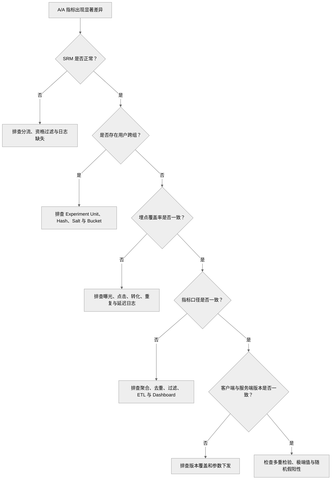

# A/A 测试｜A/A Testing

<a name="top"></a>

## 目录

- [1. 定义与边界](#sec-1)
- [2. 适用场景](#sec-2)
- [3. 实验设计](#sec-3)
  - [3.1 两组使用相同策略](#sec-3-1)
  - [3.2 使用正式实验链路](#sec-3-2)
  - [3.3 实验单位与业务周期](#sec-3-3)
- [4. 验证与分析](#sec-4)
  - [4.1 随机分流与 SRM](#sec-4-1)
  - [4.2 埋点与指标链路](#sec-4-2)
  - [4.3 基线、方差与时间趋势](#sec-4-3)
  - [4.4 统计校准](#sec-4-4)
  - [4.5 A/A Testing 与 SRM](#sec-4-5)
  - [4.6 实验层与跨入口 Assignment 校验](#sec-4-6)
  - [4.7 延迟转化与指标成熟](#sec-4-7)
- [5. 异常排查](#sec-5)
- [6. 工业案例：A/A 平台与数据链路验证](#sec-6)
  - [6.1 短视频商品内容：Assignment 与 Exposure 校验](#sec-6-1)
  - [6.2 商城商品卡：订单与退款成熟度校验](#sec-6-2)
  - [6.3 直播间分发：Cluster 推断校准](#sec-6-3)
- [7. 检查清单](#sec-7)
  - [7.1 实验配置](#sec-7-1)
  - [7.2 数据质量](#sec-7-2)
  - [7.3 统计分析](#sec-7-3)
- [8. 常见误区](#sec-8)
  - [8.1 每个 A/B Test 前都必须运行 A/A Test](#sec-8-1)
  - [8.2 A/A Test 的所有指标都必须完全相同](#sec-8-2)
  - [8.3 A/A Test 不显著就证明平台没有问题](#sec-8-3)
  - [8.4 A/A Test 显著一定说明平台有 Bug](#sec-8-4)
  - [8.5 SRM 正常就代表实验完全可信](#sec-8-5)
- [9. 分析与输出](#sec-9)
  - [9.1 需要完成的验证](#sec-9-1)
  - [9.2 异常排查顺序](#sec-9-2)
  - [9.3 A/A Readout 建议](#sec-9-3)
- [10. 关联文档](#sec-10)

---

<a name="sec-1"></a>

## 1. 定义与边界

A/A Testing 将实验单位随机分配到两个使用完全相同策略的组，用于验证实验平台，而不是评估新模型效果。

```text
Control:   Existing Strategy A
Treatment: Existing Strategy A
```

| 对比项 | A/A Testing | A/B Testing |
|---|---|---|
| Control | 策略 A | 策略 A |
| Treatment | 策略 A | 策略 B |
| 真实策略变化 | 无 | 有 |
| 主要目的 | 验证实验平台 | 验证模型或产品策略 |
| 显著差异的首要解释 | 平台、埋点、指标或随机假阳性 | 可能存在真实策略效果 |
| 是否每次都需要 | 否 | 在线决策通常需要 |

A/A Testing 不是每个 A/B Test 的固定前置步骤。成熟平台通常只在实验基础设施或关键数据链路发生变化时重新执行。

A/A Testing 的重点不是判断业务指标有没有提升，而是验证随机化、日志、指标链路和统计校准是否足以支撑后续实验分析：

```text
Randomization 是否可信？
Logging 是否可信？
Metric Pipeline 是否可信？
Statistical Calibration 是否可信？
```

只有这些基础链路可信，后续 A/B Test 的业务结论才有解释意义。

---

<a name="sec-2"></a>

## 2. 适用场景

需要执行 A/A Testing 的典型情况：

- 实验平台首次上线
- 更换 Hash 算法或 Experiment Salt 规则
- Bucket 数量、实验单位、实验层或互斥逻辑变化
- 曝光定义、埋点或 ETL Pipeline 变化
- 实时指标链路上线
- 新关键指标正式用于实验决策
- 多个 A/B Test 同时出现无法解释的偏移
- 新增短视频商品内容流、直播内容流或商城商品卡推荐之间的跨入口分流
- 直播间、商品库存或商家资格过滤逻辑变化

平台成熟、分流和数据链路未变化、仅上线新模型时，通常可以直接进入 A/B Testing。

---

<a name="sec-3"></a>

## 3. 实验设计

<a name="sec-3-1"></a>

### 3.1 两组使用相同策略

不仅模型版本相同，以下配置也应保持一致：

- 特征版本
- 召回策略
- 排序参数
- 缓存策略
- 客户端版本要求
- 降级逻辑
- 曝光资格
- Surface Routing 与跨入口用户身份规则
- 商品可售、库存和直播间资格过滤

<a name="sec-3-2"></a>

### 3.2 使用正式实验链路

A/A Test 应经过正式的随机化、分桶、参数下发、曝光、日志、指标和统计分析链路，不能使用单独编写的临时代码替代。

<a name="sec-3-3"></a>

### 3.3 实验单位与业务周期

实验单位应与后续正式实验一致，例如 User ID、Device ID、Session ID、Creator ID、Region 或 Time Window。

运行时间应覆盖主要业务周期，包括工作日与周末、高峰与低峰、新老用户和主要客户端版本。A/A Test 不以检测业务 MDE 为目标，但样本量必须足以发现系统性问题。

---

<a name="sec-4"></a>

## 4. 验证与分析

<a name="sec-4-1"></a>

### 4.1 随机分流与 SRM

```text
Experiment Unit ID
        ↓
Hash(Unit ID + Experiment Salt)
        ↓
Bucket
        ↓
Control / Treatment
```

需要检查：

- 同一实验单位是否稳定留在同一组
- 是否存在用户跨组
- Bucket 分布是否异常集中
- 实际样本比例是否符合实验配置
- 两组曝光资格和过滤条件是否一致

SRM 是前置数据质量门槛。SRM Fail 时，应暂停业务指标分析并排查分流、资格过滤、日志和数据处理链路。

<a name="sec-4-2"></a>

### 4.2 埋点与指标链路

需要验证：

- 曝光、点击和转化日志覆盖率是否一致
- 是否存在漏报、重复记录或异常延迟
- 指标口径、去重和过滤逻辑是否一致
- 分析粒度是否与随机化粒度一致
- Ratio of Sums 与 Average of Ratios 是否被混用
- ETL、Dashboard 与离线查询结果是否一致

<a name="sec-4-3"></a>

### 4.3 基线、方差与时间趋势

常见基线变量包括：

- 历史活跃度、CTR、观看时长和付费金额
- 国家、设备类型、客户端版本
- 新老用户比例和用户生命周期

有限样本中，少量差异属于正常随机波动；重点是是否出现大规模、持续性的组间偏差。

还应按小时或按天观察 Control、Treatment 及其差值。若偏差在版本发布、数据任务切换或流量高峰后突然出现，通常意味着系统链路发生变化。

<a name="sec-4-4"></a>

### 4.4 统计校准

A/A Test 的理想结果不是所有指标完全相等。单次 A/A 只能检查一次随机化实现和数据链路，不能仅凭“所有 p-value 都大于 0.05”证明统计系统已经校准。

更可靠的校准需要运行多次独立 A/A，或在历史无处理数据上执行大量 Synthetic A/A Randomization。若检验有效且原假设成立，长期来看应观察到：

- 差异围绕 0 随机波动
- 没有持续性单边偏移
- 置信区间与标准误合理
- 约定置信水平的区间具有接近标称值的 Coverage
- 多次预先指定检验的假阳性率接近设定的 Alpha
- 连续型、正确校准检验的 p-value 在 Null 下近似 Uniform

离散指标、小样本或保守检验的 p-value 不一定严格 Uniform，因此应结合仿真或 Randomization-based Calibration 判断，不能机械套用图形结论。

统计校准必须覆盖生产中实际使用的方法，包括 Ratio Linearization、CUPED、Cluster-robust SE、Cluster Bootstrap、Multiple Testing 和 Sequential Monitoring。仅校准普通 T-test，不能证明其他推断链路正确。

一次 `p-value > 0.05` 不能证明平台完全可靠；一次显著也不一定代表平台有 Bug。应结合 SRM、日志、指标链路、时间趋势和预先定义的多重检验范围综合判断。

<a name="sec-4-5"></a>

### 4.5 A/A Testing 与 SRM

| 项目 | A/A Testing | SRM Check |
|---|---|---|
| 目的 | 验证实验平台整体可靠性 | 检查实际样本比例是否符合预期 |
| 是否要求两组策略相同 | 是 | 不要求 |
| 检查范围 | 分流、日志、指标、统计分析 | 样本数量和比例 |
| 是否用于正常 A/B Test | 不是每次必需 | 每个在线实验都应执行 |
| 执行方式 | 平台验证实验 | 实验期间持续监控 |

SRM 是 A/A Testing 的重要组成部分，但也必须独立应用于正式 A/B Testing。

<a name="sec-4-6"></a>

### 4.6 实验层与跨入口 Assignment 校验

A/A 还可用于验证 Overlapping Experiment Infrastructure 本身，但需要区分“Assignment 独立”与“业务效果无交互”。A/A 能检查前者，不能证明后者。

对于两个配置为正交的 50/50 层，应检查四个交叉单元是否接近预期 25%：

| Layer A | Layer B | 期望占比 |
|---|---|---:|
| Control | Control | 25% |
| Treatment | Control | 25% |
| Control | Treatment | 25% |
| Treatment | Treatment | 25% |

若分流比例不是 50/50，期望交叉占比应由两个边际概率相乘。还需要检查：

- 同层实验是否确实互斥；
- 跨层 Salt 是否产生独立且稳定的 Assignment；
- 短视频商品内容流、直播内容流、商城商品卡推荐是否使用预期的统一用户身份；
- 用户跨设备或跨入口后是否发生 Cross-over；
- Surface-specific Eligibility 是否造成条件样本中的交叉单元比例异常。

需要注意：按“实际触发某 Surface”的用户检查交叉比例时，触发行为可能受到 Treatment 影响。平台校验应优先使用 Assignment 与实验前 Eligibility；Exposure-based 检查作为诊断，不能替代 ITT 分流检查。

<a name="sec-4-7"></a>

### 4.7 延迟转化与指标成熟

A/A 两组策略虽然相同，但短视频或直播曝光到商品页、订单、取消和退款仍存在延迟。两组若使用不同的数据截止时间、迟到日志处理或归因规则，也会产生伪差异。

需要验证：

- Assignment、Exposure、Click、Order 和 Refund 使用一致时区；
- Attribution Window 和 Maturity Window 在两组一致；
- Late-arriving Event 的回补逻辑一致；
- 每个 Observation Cohort 只在相同成熟度下比较；
- Ratio Metric 的 Numerator、Denominator、Zero-denominator 规则一致。

例如订单发生后 7 天内均可能退款，就不应将 Treatment 的新近订单与 Control 的已成熟订单直接比较 Net GMV 或 Refund Rate。

---

<a name="sec-5"></a>

## 5. 异常排查



排查时至少比较两组的曝光数量、用户覆盖率、空值比例、重复记录比例、日志延迟和客户端版本分布。

---

<a name="sec-6"></a>

## 6. 工业案例：A/A 平台与数据链路验证

以下案例用于说明验证方法；其中流量、比例和时间均为示例，不代表任何真实业务结果。

| 项目 | 配置 |
|---|---|
| Experiment Unit | User ID |
| Surfaces | 短视频商品内容流、直播内容流、商城商品卡推荐 |
| Control Traffic | 50% |
| Treatment Traffic | 50% |
| Control Strategy | Ranking Model V1 |
| Treatment Strategy | Ranking Model V1 |
| Validation Metrics | Eligible Users、Assignment、Exposure Coverage、Cross-over |
| Business Metrics | Product CTR、Order CVR、Net GMV per Assigned User |
| Guardrail Metrics | Refund Rate、Crash Rate、Latency、Complaint Rate |

总体预期结果：

```text
Treatment Effect ≈ 0
```

平台级异常示例：

```text
Net GMV per Assigned User:
Control   = 10.0
Treatment = 11.2

Relative Difference = +12.0%
```

由于两组策略相同，应依次检查 SRM、用户跨组、跨 Surface 身份、商品或直播间资格过滤、曝光与订单日志、归因成熟度、指标 SQL 和随机假阳性。下面三个案例分别把这些检查落到短视频商品内容、直播间和商城商品卡链路。

<a name="sec-6-1"></a>

### 6.1 短视频商品内容：Assignment 与 Exposure 校验

| 实验卡片字段 | 设计与判断 |
|---|---|
| 验证目标 | 确认 User Assignment、商品 Exposure 资格和客户端曝光日志均不偏向任一组 |
| 两组策略 | 同一个商品排序模型、同一套入口配置与过滤规则 |
| Eligibility | 由实验前条件定义的可进入短视频商品内容场景的用户 |
| 发生什么 | 示例：10 万名合格用户的 Assignment 为 50,120 对 49,880，但某客户端版本漏记一组曝光，使 Exposed User 比例变成 46% 对 54% |
| 为什么会误判 | 只对 Exposed User 做 SRM 会把日志缺失解释为随机化失败；只看 Assignment SRM 又会漏掉曝光链路异常 |
| 正确分析 | 先在 Eligible Assignment 上做主 SRM，再按 Group × Client Version 比较 `Exposure / Assigned Eligible User`、Null Rate 与 Duplicate Rate |
| 通过条件 | Assignment 比例符合设计，Cross-over 可忽略，修复后两组 Exposure Coverage 与迟到日志率无系统性差异 |
| 决策 | 主 SRM Fail 时停止验证；Assignment Pass 但 Exposure Fail 时修复埋点并重新运行 A/A |

<a name="sec-6-2"></a>

### 6.2 商城商品卡：订单与退款成熟度校验

| 实验卡片字段 | 设计与判断 |
|---|---|
| 验证目标 | 确认商品卡曝光、订单归因、取消与退款回补在两组使用同一口径和成熟窗口 |
| 两组策略 | 相同的商品卡召回与排序策略 |
| Eligibility | 实验前满足商城访问条件的 Assigned User；不能只保留下单用户 |
| 发生什么 | 示例：一个数据分片的 Refund Event 晚到两天，Dashboard 暂时显示 Control Refund Rate 为 4.8%、Treatment 为 3.5% |
| 为什么会误判 | 查询当天的全部订单具有不同 Maturity Age，差异可能来自迟到日志，而不是随机波动或隐藏的策略差异 |
| 正确分析 | 按 Order Cohort 对齐相同退款成熟窗口，只分析 Data Freeze Date 前已完整观察的订单，并比较 Late-arriving Rate |
| 通过条件 | Attribution、去重、时区、Maturity Window 和最终回补后的 Net Metric 均无系统性组间差异 |
| 决策 | 未成熟结果只作 Preliminary 诊断；成熟结果或回补链路 Fail 时不得批准该指标用于正式 A/B |

<a name="sec-6-3"></a>

### 6.3 直播间分发：Cluster 推断校准

| 实验卡片字段 | 设计与判断 |
|---|---|
| 验证目标 | 验证共享直播间下的标准误、置信区间和假阳性率，而不只验证用户级 Point Estimate |
| 两组策略 | 相同的直播间候选与分发策略 |
| 实验结构 | 示例：20 万名观众主要集中在 80 个直播间；数值仅用于说明“用户多、独立 Cluster 少” |
| 为什么会误判 | 把所有用户当作独立样本会低估 Standard Error，少数热门房间的共同波动可能被报告为显著平台偏差 |
| 正确分析 | 依据实际随机化设计与依赖结构，采用 Live Room、Host 或预定义 Room × Time Block 的 Cluster-robust SE、Cluster Bootstrap 或 Randomization Inference |
| 通过条件 | 报告独立 Cluster 数；在重复 A/A 或 Synthetic A/A 中，Coverage 与假阳性率接近预设水平 |
| 决策 | 用户级检验通过但 Cluster 校准失败时，仍视为平台推断链路未通过，修正后再进入正式实验 |

---

<a name="sec-7"></a>

## 7. 检查清单

<a name="sec-7-1"></a>

### 7.1 实验配置

- [ ] Control 和 Treatment 使用完全相同的策略
- [ ] 实验单位与正式 A/B Test 一致
- [ ] Hash、Salt、Bucket 和流量比例正确
- [ ] 实验组互斥逻辑正确
- [ ] 正交层的交叉单元比例符合设计
- [ ] 同一用户跨 Surface 的 Assignment 符合设计
- [ ] 两组曝光资格一致

<a name="sec-7-2"></a>

### 7.2 数据质量

- [ ] 无 SRM
- [ ] 用户不会跨组
- [ ] 两组日志覆盖率、延迟和重复率一致
- [ ] 指标计算口径一致
- [ ] Attribution / Maturity Window 一致
- [ ] Ratio Metric 的 Numerator、Denominator 与 Zero-denominator 规则一致
- [ ] Dashboard 与离线查询结果一致

<a name="sec-7-3"></a>

### 7.3 统计分析

- [ ] 基线变量基本均衡
- [ ] 指标差异围绕 0 波动
- [ ] 置信区间和方差合理
- [ ] 没有持续性单边偏移
- [ ] 已考虑多重检验
- [ ] 已检查按时间拆分的结果
- [ ] 推断方法与 Randomization / Cluster Unit 一致
- [ ] 多次 A/A 或 Synthetic A/A 的 Coverage 和 Type-I Error 接近标称水平

---

<a name="sec-8"></a>

## 8. 常见误区

<a name="sec-8-1"></a>

### 8.1 每个 A/B Test 前都必须运行 A/A Test

错误。成熟平台通常通过周期性 A/A、Canary、SRM 和数据质量监控维持可靠性。

<a name="sec-8-2"></a>

### 8.2 A/A Test 的所有指标都必须完全相同

错误。随机抽样必然产生波动，重点是差异是否符合随机波动。

<a name="sec-8-3"></a>

### 8.3 A/A Test 不显著就证明平台没有问题

错误。一次不显著不能验证完整实验链路。

<a name="sec-8-4"></a>

### 8.4 A/A Test 显著一定说明平台有 Bug

不一定。也可能是随机假阳性、多重检验或极端值，需要系统排查。

<a name="sec-8-5"></a>

### 8.5 SRM 正常就代表实验完全可信

错误。SRM 无法发现埋点差异、指标口径错误、用户跨组和统计实现问题。

---

<a name="sec-9"></a>

## 9. 分析与输出

<a name="sec-9-1"></a>

### 9.1 需要完成的验证

A/A Testing 需要验证实验基础设施产生的数据是否足以支持后续实验结论。Hash Service、日志 SDK 和实验配置平台本身可以由不同系统负责，但最终都需要在同一实验链路中被验证。

核心验证内容包括：

- 定义 A/A Test 需要验证的 Data Quality Metrics
- 检查 SRM、Cross-over 和样本覆盖
- 比较 Control / Treatment 的基线分布
- 验证曝光、点击、观看、转化等埋点是否一致
- 对比 Dashboard、离线 SQL 和 Metric Table
- 检查 Effect Difference 是否围绕 0 波动
- 判断显著差异更像系统问题还是随机假阳性
- 给出 `PASS / INVESTIGATE / FAIL` 的验证结论

SDK、Hash Service 或 Kafka 的修复通常由对应系统完成；分析时需要把异常定位到合理的链路层级，并判断它是否会影响实验结论。

<a name="sec-9-2"></a>

### 9.2 异常排查顺序

出现 A/A 指标异常时，可以按以下顺序分析：

```text
1. SRM
   ↓
2. Cross-over / Experiment Unit
   ↓
3. Logging Coverage
   ↓
4. Metric Definition / Aggregation
   ↓
5. Client / Server Version
   ↓
6. Statistical Noise / Multiple Testing
```

这是一条“先判断数据能不能信，再解释指标”的链路。

例如：

```text
Control CTR   = 10.0%
Treatment CTR = 11.1%
```

如果同时发现：

```text
Control Exposure Coverage   = 99%
Treatment Exposure Coverage = 88%
```

此时不应该先讨论 CTR 的 p-value，而应该先判断曝光分母是否被系统性漏记。

<a name="sec-9-3"></a>

### 9.3 A/A Readout 建议

A/A Test 最终可以形成一个简洁的 Readout：

| 检查项 | 结果 | 结论 |
|---|---|---|
| SRM | PASS | 样本比例符合设计 |
| Cross-over | PASS | 用户分组稳定 |
| Logging Coverage | PASS | 两组日志覆盖一致 |
| Baseline Balance | PASS | 无系统性基线偏差 |
| Metric Validation | PASS | Dashboard 与离线结果一致 |
| Statistical Calibration | PASS | 差异围绕 0 波动 |

最终结论：

```text
Experiment Platform Status: PASS
→ 可以使用该实验链路支持正式 A/B Testing
```

如果关键 Data Quality Check Fail，则不应继续使用业务指标证明平台“正常”。

---

<a name="sec-10"></a>

## 10. 关联文档

- [E-commerce Recommendation Context](./ecommerce-recommendation-context.md)
- [Recommendation System Pipeline](./recommendation-system-pipeline.md)
- [Online Experiment Lifecycle](./online-experiment-lifecycle.md)
- [Recommendation System Metrics](./metrics.md)
- [A/B Testing](./ab-testing.md)
- [Ramp-up](./ramp-up.md)
