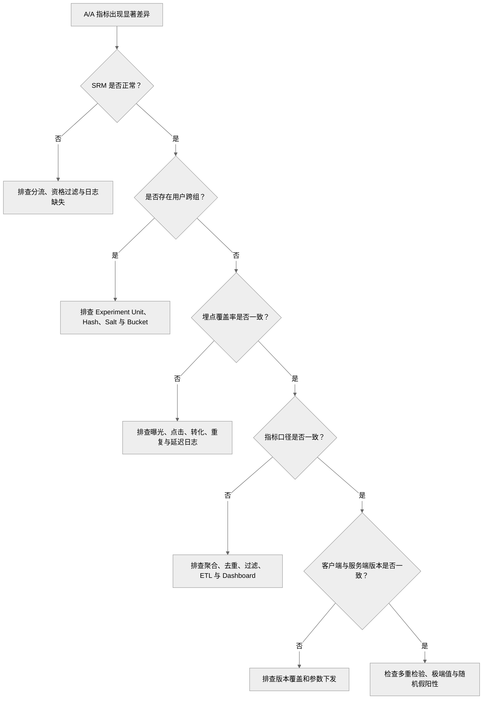

# A/A Testing

<a name="top"></a>

## 目录

- [1. 定义与边界](#sec-1)
- [2. 适用场景](#sec-2)
- [3. 实验设计](#sec-3)
  - [3.1 两组使用相同策略](#sec-3-1)
  - [3.2 使用正式实验链路](#sec-3-2)
  - [3.3 实验单位与业务周期](#sec-3-3)
- [4. 验证与分析](#sec-4)
  - [4.1 随机分流与 SRM](#sec-4-1)
  - [4.2 埋点与指标链路](#sec-4-2)
  - [4.3 基线、方差与时间趋势](#sec-4-3)
  - [4.4 统计校准](#sec-4-4)
  - [4.5 A/A Testing 与 SRM](#sec-4-5)
- [5. 异常排查](#sec-5)
- [6. 推荐系统示例](#sec-6)
- [7. 检查清单](#sec-7)
  - [实验配置](#section-16)
  - [数据质量](#section-17)
  - [统计分析](#section-18)
- [8. 常见误区](#sec-8)
  - [8.1 每个 A/B Test 前都必须运行 A/A Test](#sec-8-1)
  - [8.2 A/A Test 的所有指标都必须完全相同](#sec-8-2)
  - [8.3 A/A Test 不显著就证明平台没有问题](#sec-8-3)
  - [8.4 A/A Test 显著一定说明平台有 Bug](#sec-8-4)
  - [8.5 SRM 正常就代表实验完全可信](#sec-8-5)

---

<a name="sec-1"></a>

## 1. 定义与边界

A/A Testing 将实验单位随机分配到两个使用完全相同策略的组，用于验证实验平台，而不是评估新模型效果。

```text
Control:   Existing Strategy A
Treatment: Existing Strategy A
```

| 对比项 | A/A Testing | A/B Testing |
|---|---|---|
| Control | 策略 A | 策略 A |
| Treatment | 策略 A | 策略 B |
| 真实策略变化 | 无 | 有 |
| 主要目的 | 验证实验平台 | 验证模型或产品策略 |
| 显著差异的首要解释 | 平台、埋点、指标或随机假阳性 | 可能存在真实策略效果 |
| 是否每次都需要 | 否 | 在线决策通常需要 |

A/A Testing 不是每个 A/B Test 的固定前置步骤。成熟平台通常只在实验基础设施或关键数据链路发生变化时重新执行。

---

<a name="sec-2"></a>

## 2. 适用场景

需要执行 A/A Testing 的典型情况：

- 实验平台首次上线
- 更换 Hash 算法或 Experiment Salt 规则
- Bucket 数量、实验单位、实验层或互斥逻辑变化
- 曝光定义、埋点或 ETL Pipeline 变化
- 实时指标链路上线
- 新关键指标正式用于实验决策
- 多个 A/B Test 同时出现无法解释的偏移

平台成熟、分流和数据链路未变化、仅上线新模型时，通常可以直接进入 A/B Testing。

---

<a name="sec-3"></a>

## 3. 实验设计

<a name="sec-3-1"></a>

### 3.1 两组使用相同策略

不仅模型版本相同，以下配置也应保持一致：

- 特征版本
- 召回策略
- 排序参数
- 缓存策略
- 客户端版本要求
- 降级逻辑
- 曝光资格

<a name="sec-3-2"></a>

### 3.2 使用正式实验链路

A/A Test 应经过正式的随机化、分桶、参数下发、曝光、日志、指标和统计分析链路，不能使用单独编写的临时代码替代。

<a name="sec-3-3"></a>

### 3.3 实验单位与业务周期

实验单位应与后续正式实验一致，例如 User ID、Device ID、Session ID、Creator ID、Region 或 Time Window。

运行时间应覆盖主要业务周期，包括工作日与周末、高峰与低峰、新老用户和主要客户端版本。A/A Test 不以检测业务 MDE 为目标，但样本量必须足以发现系统性问题。

---

<a name="sec-4"></a>

## 4. 验证与分析

<a name="sec-4-1"></a>

### 4.1 随机分流与 SRM

```text
Experiment Unit ID
        ↓
Hash(Unit ID + Experiment Salt)
        ↓
Bucket
        ↓
Control / Treatment
```

需要检查：

- 同一实验单位是否稳定留在同一组
- 是否存在用户跨组
- Bucket 分布是否异常集中
- 实际样本比例是否符合实验配置
- 两组曝光资格和过滤条件是否一致

SRM 是前置数据质量门槛。SRM Fail 时，应暂停业务指标分析并排查分流、资格过滤、日志和数据处理链路。

<a name="sec-4-2"></a>

### 4.2 埋点与指标链路

需要验证：

- 曝光、点击和转化日志覆盖率是否一致
- 是否存在漏报、重复记录或异常延迟
- 指标口径、去重和过滤逻辑是否一致
- 分析粒度是否与随机化粒度一致
- Ratio of Sums 与 Average of Ratios 是否被混用
- ETL、Dashboard 与离线查询结果是否一致

<a name="sec-4-3"></a>

### 4.3 基线、方差与时间趋势

常见基线变量包括：

- 历史活跃度、CTR、观看时长和付费金额
- 国家、设备类型、客户端版本
- 新老用户比例和用户生命周期

有限样本中，少量差异属于正常随机波动；重点是是否出现大规模、持续性的组间偏差。

还应按小时或按天观察 Control、Treatment 及其差值。若偏差在版本发布、数据任务切换或流量高峰后突然出现，通常意味着系统链路发生变化。

<a name="sec-4-4"></a>

### 4.4 统计校准

A/A Test 的理想结果不是所有指标完全相等，而是：

- 差异围绕 0 随机波动
- 没有持续性单边偏移
- 置信区间与标准误合理
- 大部分置信区间覆盖 0
- 多次实验的假阳性率接近预设显著性水平
- p-value 整体分布不存在系统性异常

一次 `p-value > 0.05` 不能证明平台完全可靠；一次显著也不一定代表平台有 Bug。应结合 SRM、日志、指标链路、时间趋势和多重检验综合判断。

<a name="sec-4-5"></a>

### 4.5 A/A Testing 与 SRM

| 项目 | A/A Testing | SRM Check |
|---|---|---|
| 目的 | 验证实验平台整体可靠性 | 检查实际样本比例是否符合预期 |
| 是否要求两组策略相同 | 是 | 不要求 |
| 检查范围 | 分流、日志、指标、统计分析 | 样本数量和比例 |
| 是否用于正常 A/B Test | 不是每次必需 | 每个在线实验都应执行 |
| 执行方式 | 平台验证实验 | 实验期间持续监控 |

SRM 是 A/A Testing 的重要组成部分，但也必须独立应用于正式 A/B Testing。

---

<a name="sec-5"></a>

## 5. 异常排查



排查时至少比较两组的曝光数量、用户覆盖率、空值比例、重复记录比例、日志延迟和客户端版本分布。

---

<a name="sec-6"></a>

## 6. 推荐系统示例

| 项目 | 配置 |
|---|---|
| Experiment Unit | User ID |
| Control Traffic | 50% |
| Treatment Traffic | 50% |
| Control Strategy | Ranking Model V1 |
| Treatment Strategy | Ranking Model V1 |
| Primary Metric | Watch Time per User |
| Secondary Metrics | CTR、Completion Rate、Retention |
| Guardrail Metrics | Crash Rate、Latency、Complaint Rate |

预期结果：

```text
Treatment Effect ≈ 0
```

异常示例：

```text
CTR:
Control   = 10.0%
Treatment = 11.2%

Relative Difference = +12.0%
```

由于两组策略相同，应依次检查 SRM、用户跨组、曝光资格、日志完整性、客户端版本、指标 SQL 和随机假阳性。

---

<a name="sec-7"></a>

## 7. 检查清单

<a name="section-16"></a>

### 实验配置

- [ ] Control 和 Treatment 使用完全相同的策略
- [ ] 实验单位与正式 A/B Test 一致
- [ ] Hash、Salt、Bucket 和流量比例正确
- [ ] 实验组互斥逻辑正确
- [ ] 两组曝光资格一致

<a name="section-17"></a>

### 数据质量

- [ ] 无 SRM
- [ ] 用户不会跨组
- [ ] 两组日志覆盖率、延迟和重复率一致
- [ ] 指标计算口径一致
- [ ] Dashboard 与离线查询结果一致

<a name="section-18"></a>

### 统计分析

- [ ] 基线变量基本均衡
- [ ] 指标差异围绕 0 波动
- [ ] 置信区间和方差合理
- [ ] 没有持续性单边偏移
- [ ] 已考虑多重检验
- [ ] 已检查按时间拆分的结果

---

<a name="sec-8"></a>

## 8. 常见误区

<a name="sec-8-1"></a>

### 8.1 每个 A/B Test 前都必须运行 A/A Test

错误。成熟平台通常通过周期性 A/A、Canary、SRM 和数据质量监控维持可靠性。

<a name="sec-8-2"></a>

### 8.2 A/A Test 的所有指标都必须完全相同

错误。随机抽样必然产生波动，重点是差异是否符合随机波动。

<a name="sec-8-3"></a>

### 8.3 A/A Test 不显著就证明平台没有问题

错误。一次不显著不能验证完整实验链路。

<a name="sec-8-4"></a>

### 8.4 A/A Test 显著一定说明平台有 Bug

不一定。也可能是随机假阳性、多重检验或极端值，需要系统排查。

<a name="sec-8-5"></a>

### 8.5 SRM 正常就代表实验完全可信

错误。SRM 无法发现埋点差异、指标口径错误、用户跨组和统计实现问题。
