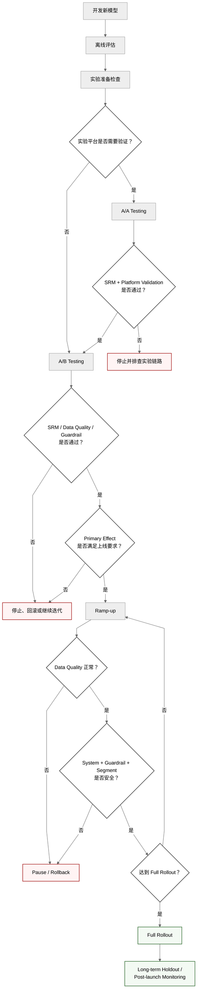
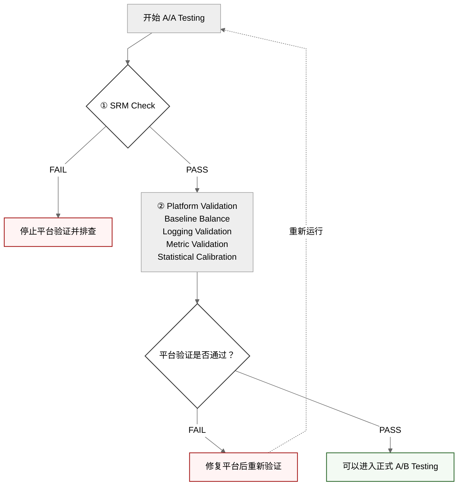
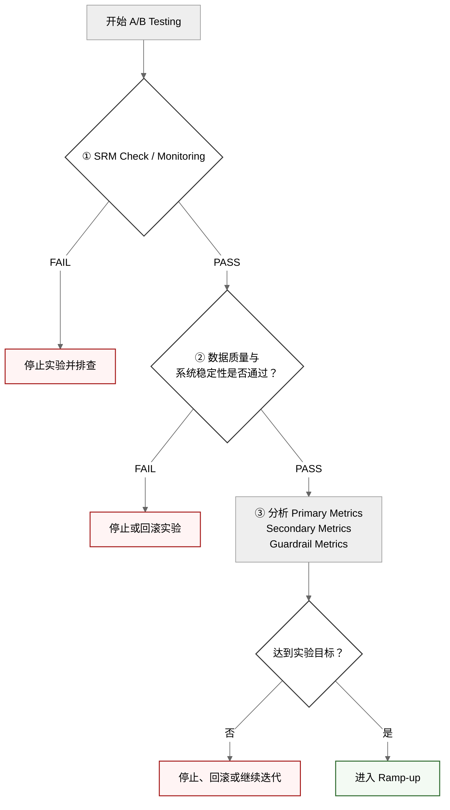
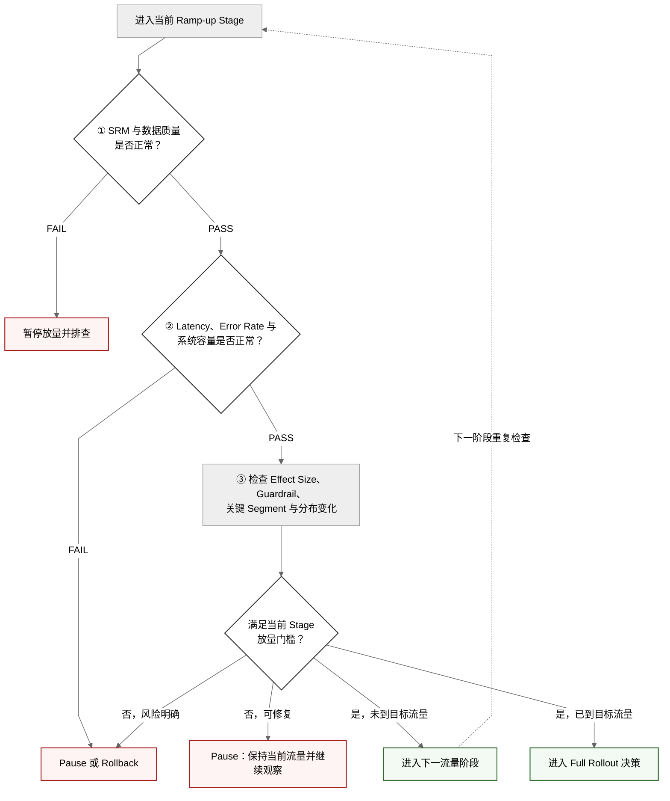
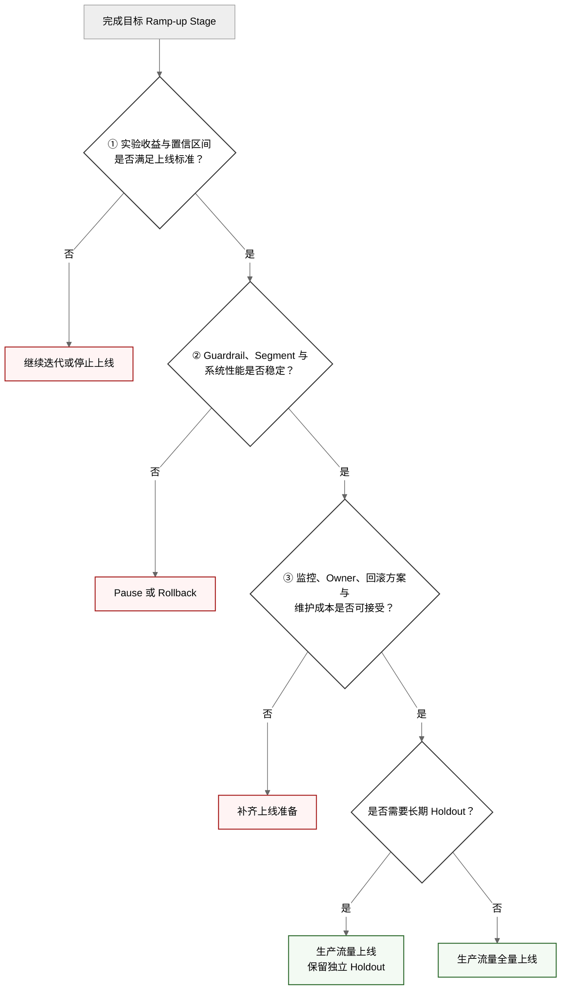
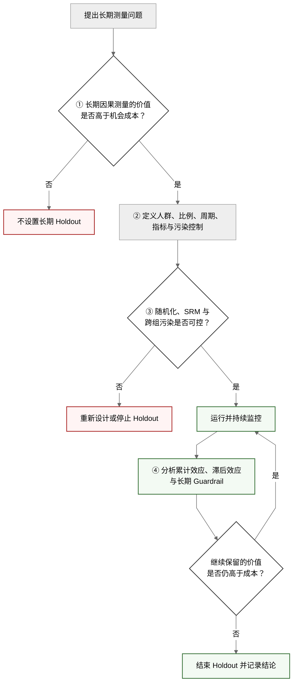

# 推荐系统在线实验流程｜Online Experiment Lifecycle

<a name="top"></a>

## 目录

- [1. 概述](#sec-1)
- [2. 完整流程](#sec-2)
- [3. 开发新模型](#sec-3)
  - [3.1 定义业务问题](#sec-3-1)
  - [3.2 定义实验假设](#sec-3-2)
  - [3.3 明确策略变化范围](#sec-3-3)
- [4. 离线评估｜Offline Evaluation](#sec-4)
  - [4.1 模型效果指标](#sec-4-1)
  - [4.2 工程性能指标](#sec-4-2)
  - [4.3 离线评估的限制](#sec-4-3)
- [5. 实验准备检查｜Experiment Readiness Check](#sec-5)
  - [5.1 实验单位](#sec-5-1)
  - [5.2 实验指标](#sec-5-2)
  - [5.3 实验配置](#sec-5-3)
- [6. A/A Testing](#sec-6)
  - [6.1 什么时候需要 A/A Testing](#sec-6-1)
  - [6.2 验证内容](#sec-6-2)
- [7. A/B Testing](#sec-7)
  - [7.1 分析流程](#sec-7-1)
  - [7.2 初始流量](#sec-7-2)
  - [7.3 实验期间持续监控](#sec-7-3)
- [8. SRM｜Sample Ratio Mismatch](#sec-8)
  - [8.1 检查时机](#sec-8-1)
- [9. Ramp-up](#sec-9)
  - [9.1 Ramp-up 的目的](#sec-9-1)
  - [9.2 每次放量前的检查](#sec-9-2)
  - [9.3 Ramp-up 不等于重新随机](#sec-9-3)
- [10. Full Rollout](#sec-10)
  - [10.1 Full Rollout 与 Holdout](#sec-10-1)
- [11. Long-term Holdout](#sec-11)
  - [11.1 Holdout 可以回答什么](#sec-11-1)
  - [11.2 Holdout 的适用场景](#sec-11-2)
  - [11.3 Holdout 的成本](#sec-11-3)
- [12. Go / No-Go 决策门槛](#sec-12)
- [13. 常见误区](#sec-13)
  - [13.1 每个 A/B Test 前都必须运行 A/A Test](#sec-13-1)
  - [13.2 SRM 只需要在实验开始时检查一次](#sec-13-2)
  - [13.3 离线指标提升就可以直接上线](#sec-13-3)
  - [13.4 Ramp-up 只是扩大流量](#sec-13-4)
  - [13.5 100% 上线后仍然天然存在 Control](#sec-13-5)
  - [13.6 所有实验都必须保留 Holdout](#sec-13-6)
- [14. 各阶段的分析重点](#sec-14)
  - [14.1 核心判断链路](#sec-14-1)
  - [14.2 生命周期不是机械流水线](#sec-14-2)
- [15. 关联文档](#sec-15)

---

<a name="sec-1"></a>

## 1. 概述

推荐系统的新模型通常经过模型开发、离线评估、实验准备、在线实验、逐步放量和长期效果验证。

核心原则：

- A/A Testing 用于验证实验平台，只在平台首次上线或关键链路发生变化时执行。
- A/B Testing 用于验证新模型或新策略的真实业务价值。
- SRM 是 A/A 和 A/B 的数据质量门槛，并应在实验运行期间持续监控。
- Ramp-up、Full Rollout 和 Long-term Holdout 分别用于风险控制、正式上线和长期测量。

这套流程可以进一步理解为：

```text
定义问题
↓
证明模型离线可行
↓
确认实验数据可信
↓
估计线上因果增量
↓
验证扩大流量后的稳定性
↓
评估长期价值
```

---

<a name="sec-2"></a>

## 2. 完整流程



平台不需要重新验证时，可以跳过 A/A Testing，直接进入 A/B Testing；需要重新验证时，只有 SRM 和平台校验均通过，才能进入正式 A/B Testing。

---

<a name="sec-3"></a>

## 3. 开发新模型

模型开发应从明确的业务问题开始，而不是只追求离线指标提升。

<a name="sec-3-1"></a>

### 3.1 定义业务问题

例如：

- 提升用户有效观看时长
- 提升商品推荐转化率
- 提升新用户次日留存
- 降低低质量内容曝光
- 提升长尾内容覆盖率

<a name="sec-3-2"></a>

### 3.2 定义实验假设

一个可验证的实验假设应包含：

- 改变什么
- 为什么可能有效
- 影响哪些用户
- 主要提升什么指标
- 可能损害哪些 Guardrail Metrics

示例：

> 在精排模型中加入长期兴趣特征，可以提升人均有效观看时长，同时不显著损害内容多样性和系统延迟。

<a name="sec-3-3"></a>

### 3.3 明确策略变化范围

需要记录：

- 模型版本
- 特征版本
- 训练数据窗口
- 召回和排序链路变化
- 参数变化
- 降级策略
- 适用用户范围

---

<a name="sec-4"></a>

## 4. 离线评估｜Offline Evaluation

离线评估用于过滤明显无效或高风险的方案，但不能替代在线 A/B Testing。

<a name="sec-4-1"></a>

### 4.1 模型效果指标

推荐排序常见指标包括：

- AUC
- Log Loss
- NDCG@K
- Recall@K
- Precision@K
- Calibration
- Coverage
- Diversity

<a name="sec-4-2"></a>

### 4.2 工程性能指标

还需要评估：

- P50、P95、P99 Latency
- CPU 和 GPU 使用率
- 内存占用
- QPS
- Feature Freshness
- Timeout Rate
- Fallback Rate

<a name="sec-4-3"></a>

### 4.3 离线评估的限制

离线指标无法完整反映：

- 用户行为反馈
- 曝光偏差
- 策略之间的竞争关系
- 长期用户满意度
- 内容供给变化
- 创作者行为变化
- 系统级网络效应

因此，离线评估通过后仍需要在线实验。

---

<a name="sec-5"></a>

## 5. 实验准备检查｜Experiment Readiness Check

<a name="sec-5-1"></a>

### 5.1 实验单位

| 实验单位 | 常见场景 |
|---|---|
| User ID | 用户级推荐和长期体验 |
| Device ID | 匿名用户 |
| Session ID | 会话级策略 |
| Creator ID | 创作者工具或激励实验 |
| Region | 地区级运营策略 |
| Time Window | Switchback Experiment |

<a name="sec-5-2"></a>

### 5.2 实验指标

| 类型 | 作用 |
|---|---|
| Primary Metric | 决定实验是否成功 |
| Secondary Metrics | 帮助解释用户行为变化 |
| Guardrail Metrics | 防止局部优化损害系统健康 |

<a name="sec-5-3"></a>

### 5.3 实验配置

上线前应确认：

- Control 和 Treatment 的策略版本
- Experiment Salt
- Bucket 区间
- 流量比例
- 实验层和互斥关系
- 用户资格条件
- 实验开始和结束时间
- Ramp-up 计划
- 回滚条件

---

<a name="sec-6"></a>

## 6. A/A Testing

A/A Testing 用于验证实验平台，而不是评估新模型效果。

<a name="sec-6-1"></a>

### 6.1 什么时候需要 A/A Testing

通常需要执行 A/A Testing 的情况：

- 实验平台首次上线
- Hash 或 Bucket 逻辑变化
- Experiment Unit 变化
- 实验层或互斥系统变化
- 曝光埋点变化
- 指标计算链路变化
- 新客户端 SDK 上线
- 多个实验同时出现异常

通常可以跳过 A/A Testing 的情况：

- 实验平台已经成熟
- 分流和埋点没有变化
- 只是上线新的推荐模型
- 使用的是已经验证过的指标
- 实验配置遵循标准模板

```text
Control:   Existing Model
Treatment: Existing Model
```

<a name="sec-6-2"></a>

### 6.2 验证内容

- SRM（Sample Ratio Mismatch）
- Baseline Balance（基线均衡性）
- Exposure Qualification（一致的曝光资格）
- Logging Validation（埋点完整性）
- Metric Validation（指标计算正确性）
- Statistical Calibration（统计检验校准）

在分析顺序上，可以表示为：



工程上，这些检查可能同时计算；但在分析逻辑上，SRM 是前置质量门槛。SRM Fail 时，不应继续使用后续指标差异来证明平台有效。

---

<a name="sec-7"></a>

## 7. A/B Testing

```text
Control:   Existing Model
Treatment: New Model
```

A/B Testing 用于判断新模型或新策略是否优于当前线上方案。

<a name="sec-7-1"></a>

### 7.1 分析流程



<a name="sec-7-2"></a>

### 7.2 初始流量

高风险模型通常从较小流量开始：

```text
Control   = 95%
Treatment = 5%
```

低风险且平台成熟的实验也可能直接使用：

```text
Control   = 50%
Treatment = 50%
```

具体比例取决于：

- 风险等级
- 所需样本量
- 实验周期
- 系统容量
- 用户影响范围
- 回滚能力

<a name="sec-7-3"></a>

### 7.3 实验期间持续监控

- SRM
- 用户跨组
- 日志延迟
- 指标缺失率
- Crash Rate
- Error Rate
- Latency
- Complaint Rate
- 核心业务指标

---

<a name="sec-8"></a>

## 8. SRM｜Sample Ratio Mismatch

SRM 用于判断实验实际分组比例是否符合设计比例。它只检查样本比例，不分析 CTR、CVR、Watch Time 等业务指标。

例如实验设计为：

```text
Control   = 50%
Treatment = 50%
```

实际观测为：

```text
Control   = 49.9%
Treatment = 50.1%
```

通常可能属于合理随机波动。

如果实际观测为：

```text
Control   = 45%
Treatment = 55%
```

则需要立即排查。

<a name="sec-8-1"></a>

### 8.1 检查时机

SRM 应在以下阶段持续执行：

- A/A Testing
- A/B Testing 初期
- 每次 Ramp-up 后
- 实验运行期间
- 实验结束分析前

SRM 不是 A/A 与 A/B 之间的独立阶段，而是两类实验都必须执行的数据质量检查。

---

<a name="sec-9"></a>

## 9. Ramp-up

Ramp-up 是逐步扩大 Treatment 流量的过程。

```text
1% → 5% → 10% → 25% → 50% → 100%
```

每个流量阶段都使用相同的判断顺序：



<a name="sec-9-1"></a>

### 9.1 Ramp-up 的目的

- 降低线上事故影响范围
- 验证系统容量
- 观察延迟和错误率
- 提前发现边缘用户问题
- 验证效果是否随流量扩大保持稳定

<a name="sec-9-2"></a>

### 9.2 每次放量前的检查

| 检查项 | 示例 |
|---|---|
| 数据质量 | 无 SRM、无日志异常 |
| 系统稳定性 | Latency 和 Error Rate 正常 |
| Primary Metric | 达到预期或至少没有明显恶化 |
| Guardrail Metrics | 未超过风险阈值 |
| 分群结果 | 关键国家、设备和用户群无严重负向 |
| 回滚能力 | 能够快速恢复旧策略 |

<a name="sec-9-3"></a>

### 9.3 Ramp-up 不等于重新随机

```text
5% Treatment:
Bucket 0–499

10% Treatment:
Bucket 0–999

25% Treatment:
Bucket 0–2499
```

稳定的 Hash Bucketing 可以保留原有 Treatment 用户，并加入新的 Bucket。

更完整的指标设计、阶段 Readout 和回滚方法见 [Ramp-up](./ramp-up.md)。

---

<a name="sec-10"></a>

## 10. Full Rollout

当实验结果、系统性能和 Guardrail Metrics 均满足要求后，新模型可以成为默认生产策略。



通常所说的“100% 上线”是指：

> 新策略成为符合条件生产流量的默认策略。

上线决策应综合考虑：

- 效果大小
- 置信区间
- 实验持续时间
- 关键用户分群
- 长期指标
- 工程成本
- 模型维护成本
- 业务风险

<a name="sec-10-1"></a>

### 10.1 Full Rollout 与 Holdout

如果所有用户都使用 Treatment，则不存在同时期的 Control 组。

因此，严格来说：

```text
100% Treatment
```

和

```text
保留同期 Holdout Control
```

不能在同一用户范围内同时成立。

工业实践中的“100% 上线”通常有两种含义：

1. 对普通生产流量全量上线，但排除一个独立的长期 Holdout 人群。
2. 完全取消 Control，后续通过其他实验或时间序列方法评估长期效果。

---

<a name="sec-11"></a>

## 11. Long-term Holdout

Holdout 是长期保留旧策略或基础策略的一小部分用户，用于衡量累计效果和长期副作用。

```text
New Model          = 98%
Long-term Holdout  = 2%
```



<a name="sec-11-1"></a>

### 11.1 Holdout 可以回答什么

- 短期提升是否能够长期保持
- 用户是否出现适应或疲劳
- 留存影响是否滞后出现
- 内容供给是否逐渐改变
- 创作者生态是否受到影响
- 多个已上线策略的累计效果是多少

<a name="sec-11-2"></a>

### 11.2 Holdout 的适用场景

- 长期推荐目标优化
- 广告负载变化
- 用户增长策略
- 创作者激励
- 多项策略叠加上线
- 难以通过短期实验观测的指标

<a name="sec-11-3"></a>

### 11.3 Holdout 的成本

- 机会成本
- 流量成本
- 实验污染
- 用户跨组风险
- 长期维护成本

Holdout 不是每个模型上线后的必选步骤。

---

<a name="sec-12"></a>

## 12. Go / No-Go 决策门槛

| 阶段 | Go 条件 | No-Go 条件 |
|---|---|---|
| 离线评估 | 模型和工程指标满足最低要求 | 离线效果下降或性能不可接受 |
| 实验准备 | 配置、埋点和回滚方案完整 | 指标口径不清或无法快速回滚 |
| A/A Testing | 无系统性偏差，平台链路可信 | SRM、日志或指标链路异常 |
| A/B Testing | Primary Metric 改善，Guardrail 可接受 | 核心指标下降或风险过高 |
| Ramp-up | 效果稳定，系统容量正常 | 放量后出现异常或效果反转 |
| Full Rollout | 综合收益大于成本和风险 | 结果不稳定或长期风险未知 |
| Holdout | 长期测量价值高于机会成本 | 流量成本过高或污染严重 |

---

<a name="sec-13"></a>

## 13. 常见误区

<a name="sec-13-1"></a>

### 13.1 每个 A/B Test 前都必须运行 A/A Test

错误。A/A Test 主要验证实验平台，不是每个业务实验的固定步骤。

<a name="sec-13-2"></a>

### 13.2 SRM 只需要在实验开始时检查一次

错误。SRM 应在实验运行期间和每次流量调整后持续检查。

<a name="sec-13-3"></a>

### 13.3 离线指标提升就可以直接上线

错误。离线指标无法完整反映真实用户行为和长期生态影响。

<a name="sec-13-4"></a>

### 13.4 Ramp-up 只是扩大流量

不完整。每次扩大流量都应重新验证数据质量、系统稳定性和业务指标。

<a name="sec-13-5"></a>

### 13.5 100% 上线后仍然天然存在 Control

错误。除非平台单独保留长期 Holdout，否则全量上线后没有同期 Control。

<a name="sec-13-6"></a>

### 13.6 所有实验都必须保留 Holdout

错误。Holdout 适合长期、高影响和累计效应明显的策略，但会带来机会成本。

---

<a name="sec-14"></a>

## 14. 各阶段的分析重点

| 阶段 | 核心任务 | 主要输出 |
|---|---|---|
| Model Development | 明确业务问题与可检验假设 | Hypothesis / Success Criteria |
| Offline Evaluation | 评估模型效果与可上线性 | Offline Readout |
| Readiness Check | 确认指标、实验单位和数据链路 | Experiment Design |
| A/A Testing | 验证实验平台与数据可信度 | Platform PASS / FAIL |
| A/B Testing | 估计 Treatment Effect | Experiment Readout |
| Ramp-up | 验证 Effect Stability 与风险 | Continue / Pause / Rollback |
| Full Rollout | 确认生产指标稳定 | Launch Readout |
| Holdout | 评估长期累计效果 | Long-term Impact |

<a name="sec-14-1"></a>

### 14.1 核心判断链路

可以把整个生命周期压缩成六个问题：

```text
1. 我们到底想改善什么？
2. 离线证据是否足够支持上线实验？
3. 实验数据是否可信？
4. Treatment 是否产生真实且有业务意义的增量？
5. 流量扩大后收益和风险是否稳定？
6. 长期用户和生态价值是否仍然成立？
```

这些问题分别对应：

```text
Metrics
→ Offline Evaluation
→ A/A / Data Quality
→ A/B Testing
→ Ramp-up
→ Holdout / Post-launch Monitoring
```

<a name="sec-14-2"></a>

### 14.2 生命周期不是机械流水线

例如：

```text
A/B p-value < 0.05
→ Ramp-up
→ 100%
```

是不完整的。

实际 Go / No-Go 决策还需要结合：

- Effect Size
- Confidence Interval
- Guardrail Metrics
- Segment Risk
- Data Quality
- System Health
- Business Value
- Long-term Risk

最终决策需要把实验结果、数据质量、系统风险、业务价值和长期影响组合起来解释。

---

<a name="sec-15"></a>

## 15. 关联文档

- [E-commerce Recommendation Context](./ecommerce-recommendation-context.md)
- [Recommendation System Pipeline](./recommendation-system-pipeline.md)
- [Recommendation System Metrics](./metrics.md)
- [A/A Testing](./aa-testing.md)
- [A/B Testing](./ab-testing.md)
- [Ramp-up](./ramp-up.md)
