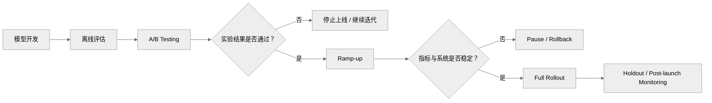
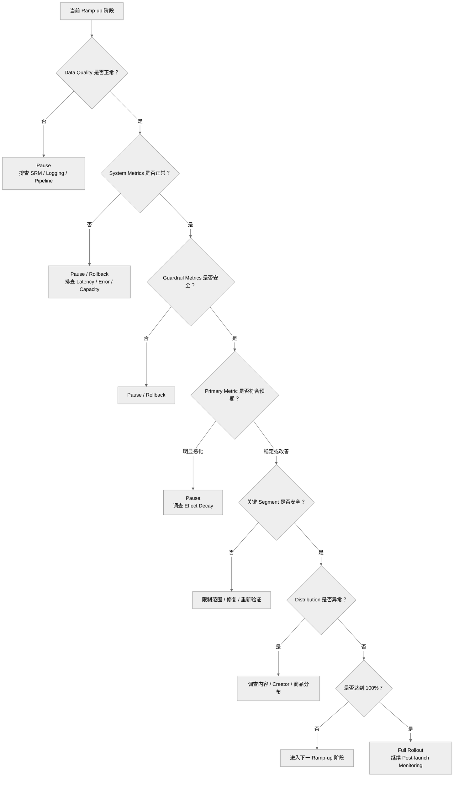

# 灰度放量｜Ramp-up

<a name="top"></a>

## 目录

- [1. 定义与边界](#sec-1)
- [2. Ramp-up 在在线实验流程中的位置](#sec-2)
  - [2.1 Experiment Ramp-up](#sec-2-1)
  - [2.2 Launch Ramp-up](#sec-2-2)
- [3. Ramp-up 与 A/B Testing 的区别](#sec-3)
- [4. 为什么不能直接 Full Rollout](#sec-4)
  - [4.1 小流量无法暴露全部风险](#sec-4-1)
  - [4.2 系统容量与延迟风险](#sec-4-2)
  - [4.3 Population Shift](#sec-4-3)
  - [4.4 推荐生态反馈](#sec-4-4)
  - [4.5 Treatment Saturation 与 Marketplace Spillover](#sec-4-5)
- [5. Ramp-up 策略设计](#sec-5)
  - [5.1 常见流量阶梯](#sec-5-1)
  - [5.2 固定 Control 与稳定放量](#sec-5-2)
  - [5.3 按人群、版本与地区灰度](#sec-5-3)
  - [5.4 每个阶段观察多久](#sec-5-4)
  - [5.5 同期实验与 Factorial 组合](#sec-5-5)
- [6. Ramp-up 分析重点](#sec-6)
  - [6.1 设计监控指标](#sec-6-1)
  - [6.2 判断是否可以继续放量](#sec-6-2)
  - [6.3 区分异常来源](#sec-6-3)
  - [6.4 分析用户异质性](#sec-6-4)
  - [6.5 支持 Go / Pause / Rollback](#sec-6-5)
- [7. Ramp-up 监控指标](#sec-7)
  - [7.1 Primary Metrics](#sec-7-1)
  - [7.2 Guardrail Metrics](#sec-7-2)
  - [7.3 System Metrics](#sec-7-3)
  - [7.4 Data Quality Metrics](#sec-7-4)
  - [7.5 Segment Metrics](#sec-7-5)
  - [7.6 Distribution Metrics](#sec-7-6)
- [8. Continue、Pause 与 Rollback 决策](#sec-8)
  - [8.1 Continue](#sec-8-1)
  - [8.2 Pause](#sec-8-2)
  - [8.3 Rollback](#sec-8-3)
- [9. Ramp-up 决策流程](#sec-9)
- [10. Ramp-up 中的统计分析](#sec-10)
  - [10.1 不要机械地重新做显著性判断](#sec-10-1)
  - [10.2 Effect Size 与 Confidence Interval](#sec-10-2)
  - [10.3 Population Mix 与 Segment Shift](#sec-10-3)
  - [10.4 Peeking 与短期波动](#sec-10-4)
  - [10.5 累积数据、阶段数据与序贯决策](#sec-10-5)
- [11. 工业案例：电商推荐放量](#sec-11)
  - [11.1 短视频商品排序：Effect Decay](#sec-11-1)
  - [11.2 直播间分发：共享房间与 Saturation](#sec-11-2)
  - [11.3 商城商品卡：支付、取消与退款成熟](#sec-11-3)
  - [11.4 召回 × 精排：Factorial Cell Mix](#sec-11-4)
  - [11.5 自然、联盟与付费流量协同放量](#sec-11-5)
  - [11.6 跨案例决策模板](#sec-11-6)
- [12. 自动停止与回滚规则](#sec-12)
- [13. Ramp-up 检查清单](#sec-13)
  - [13.1 放量前](#sec-13-1)
  - [13.2 放量中](#sec-13-2)
  - [13.3 放量后](#sec-13-3)
- [14. 常见误区](#sec-14)
  - [14.1 A/B Test 赢了就可以直接 100%](#sec-14-1)
  - [14.2 Ramp-up 只看 Primary Metric](#sec-14-2)
  - [14.3 每一步都必须重新达到 p-value < 0.05](#sec-14-3)
  - [14.4 Overall Metric 正常就代表所有用户正常](#sec-14-4)
  - [14.5 指标异常一定是模型问题](#sec-14-5)
  - [14.6 Pause 和 Rollback 是一回事](#sec-14-6)
  - [14.7 Ramp-up 是纯工程问题](#sec-14-7)
- [15. Ramp-up Readout](#sec-15)
  - [15.1 每个阶段建议报告什么](#sec-15-1)
  - [15.2 比较不同 Ramp-up Stage 时要保持口径一致](#sec-15-2)
  - [15.3 Effect Decay 的排查框架](#sec-15-3)
- [16. 需要理解的工程能力](#sec-16)
- [17. 关联文档](#sec-17)

---

<a name="sec-1"></a>

## 1. 定义与边界

灰度放量（Ramp-up / Gradual Rollout）指将新模型、新策略或新产品能力从较小范围的线上流量逐步扩大到更多用户，并在每个阶段持续验证数据质量、业务收益、系统稳定性和护栏指标。

典型过程：

```text
5%
↓
10%
↓
25%
↓
50%
↓
100%
```

Ramp-up 的主要目标不是重新证明模型“是否有效”，而是：

- 控制上线风险
- 限制异常模型或 Bug 的影响范围
- 验证策略在更大规模流量下是否仍然稳定
- 检查 Guardrail Metrics 是否恶化
- 发现小流量阶段没有暴露的 Segment 风险
- 验证系统容量、日志链路和数据质量
- 为 Full Rollout 提供最终上线依据
- 保留快速 Pause 或 Rollback 的能力

Ramp-up 的核心问题是：

> **随着真实流量逐步扩大，实验中的收益是否仍然存在，同时风险是否仍然可控。**

Ramp-up 不等于部署系统本身。

Kubernetes、Load Balancer、Service Deployment 和具体流量路由属于部署实现；Ramp-up 分析更关注指标设计、数据验证、效果稳定性和上线决策。

---

<a name="sec-2"></a>

## 2. Ramp-up 在在线实验流程中的位置

典型推荐系统上线流程：



Ramp-up 一般出现在 A/B Testing 与 Full Rollout 之间。

但工业系统中，“Ramp-up”可能指两种不同过程。

<a name="sec-2-1"></a>

### 2.1 Experiment Ramp-up

指 A/B Test 本身逐步扩大实验流量。

例如：

```text
Control   1%
Treatment 1%

↓ 验证 SRM / Logging / Latency

Control   5%
Treatment 5%

↓ 继续观察

Control   10%
Treatment 10%
```

核心目标包括：

- 确认实验配置正确
- 控制实验初期风险
- 获取更多样本
- 逐渐达到正式统计分析需要的流量

<a name="sec-2-2"></a>

### 2.2 Launch Ramp-up

指 A/B Test 已经通过后，将新策略逐步变成线上默认策略。

例如：

```text
A/B Test Passed
↓
10% New Model
↓
25%
↓
50%
↓
100%
```

核心目标是：

- 验证大规模流量下的稳定性
- 发现容量或 Segment 风险
- 控制上线事故影响范围
- 决定是否进入 Full Rollout

分析时首先要明确：

```text
当前是在扩大“实验流量”
还是
扩大“正式上线流量”
```

否则容易混淆统计推断和上线风险控制。

---

<a name="sec-3"></a>

## 3. Ramp-up 与 A/B Testing 的区别

A/B Testing 和 Ramp-up 都会涉及流量比例，但核心目的不同。

| 对比项 | A/B Testing | Ramp-up |
|---|---|---|
| 核心问题 | 新策略是否优于旧策略 | 新策略扩大上线是否安全 |
| 主要目的 | 估计 Treatment Effect | 控制上线风险 |
| Control | 通常必须存在 | 取决于上线设计 |
| Treatment | 待验证的新策略 | 已经通过初步验证的新策略 |
| Primary Metric | 核心决策依据 | 用于确认收益是否保持 |
| Guardrail Metrics | 必须检查 | 极其重要 |
| System Metrics | 需要监控 | 通常更重要 |
| Data Quality | 必须检查 | 必须持续检查 |
| Statistical Significance | 核心统计问题之一 | 不一定是每一步的核心 |
| Rollback | 可以停止实验 | 必须具备快速回滚能力 |

可以简单记忆：

```text
A/B Testing
= 值不值得上线？

Ramp-up
= 能不能安全扩大上线？
```

A/B Testing 更偏因果推断。

Ramp-up 更偏：

```text
Effect Stability
+
Risk Control
+
System Safety
+
Data Reliability
```

---

<a name="sec-4"></a>

## 4. 为什么不能直接 Full Rollout

即使 A/B Test 显著提升，也不能自动推出：

```text
A/B Test Win
→ 直接 100%
```

小流量下没有暴露的问题，可能在大流量下被放大。

<a name="sec-4-1"></a>

### 4.1 小流量无法暴露全部风险

5% 流量可能没有充分覆盖：

- Low-end Device
- 老版本客户端
- 小语种用户
- 新用户
- Heavy Users
- 特定国家
- 特定内容类别
- 特定 Creator Segment

例如：

```text
Overall Watch Time +2.0%
Low-end Device Watch Time -7.0%
```

Overall Metric 看起来很好，但某个重要 Segment 已经受损。

<a name="sec-4-2"></a>

### 4.2 系统容量与延迟风险

新模型可能比旧模型更复杂。

例如：

```text
5% Traffic
P95 Latency = 80 ms

50% Traffic
P95 Latency = 150 ms
```

可能原因包括：

- CPU / GPU Saturation
- Cache Miss 增加
- Feature Service 压力增加
- Model Serving Queue 增长
- Network Bottleneck
- Timeout 增加

这些问题在小流量实验阶段可能不明显。

<a name="sec-4-3"></a>

### 4.3 Population Shift

如果 Ramp-up 不是简单随机扩大，而是按 Region、Device、Version 或 Market 扩大，新增流量可能与原实验用户不同。

例如：

```text
Stage 1:
Singapore

Stage 2:
Singapore + Indonesia
```

此时 Overall Metric 发生变化，可能来自：

```text
Population Mix Change
```

而不一定是模型效果本身发生变化。

<a name="sec-4-4"></a>

### 4.4 推荐生态反馈

推荐系统会改变内容分发和创作者供给。

例如新模型短期：

```text
Watch Time ↑
CTR ↑
```

但扩大后可能逐渐出现：

```text
Content Diversity ↓
Head Content Concentration ↑
Tail Creator Exposure ↓
Negative Feedback ↑
```

因此推荐系统 Ramp-up 不能只关注短期消费指标。

<a name="sec-4-5"></a>

### 4.5 Treatment Saturation 与 Marketplace Spillover

在没有跨用户干扰时，扩大 Treatment 比例主要改变样本量和风险暴露；在共享市场中，Treatment 比例本身可能改变 Treatment Effect。

电商推荐中的典型机制包括：

- 短视频商品内容流和商城商品卡推荐争用同一商品库存；
- 直播内容流将更多用户送入有限直播间，改变热度、互动和主播行为；
- 曝光增长促使商家调价、补货、增加投放或改变商品供给；
- 新召回通道扩大后占用共享精排预算、缓存或流量配额；
- Treatment 商品更早售罄，使 Control 用户面对不同候选集合。

因此，小流量用户级 A/B Test 估计的可能是低 Saturation 下的 Direct Effect，不一定等于全量上线后的 Equilibrium Effect：

```text
5% Treatment  → Control 几乎处在原市场状态
50% Treatment → 库存、直播间和商家反馈已经变化
100% Rollout  → 不再存在同一个同期反事实市场
```

当 Lift 随流量变化时，应同时检查 Population Mix、System Capacity 和 Marketplace Saturation。Cluster Randomization、Geo-Time Switchback、Two-sided Experiment 或不同 Saturation Arms 可以帮助识别此类效应；仅用用户级 Cluster Bootstrap 不能修复 Control Contamination。

---

<a name="sec-5"></a>

## 5. Ramp-up 策略设计

<a name="sec-5-1"></a>

### 5.1 常见流量阶梯

没有统一的 Ramp-up 比例。

典型方案：

```text
1%
↓
5%
↓
10%
↓
25%
↓
50%
↓
100%
```

也可能是：

```text
5%
↓
20%
↓
50%
↓
100%
```

Ramp-up 速度通常取决于：

- 模型风险
- 流量规模
- 系统复杂度
- Guardrail 严格程度
- 是否存在安全或合规风险
- 历史类似模型经验
- 是否需要覆盖完整业务周期

<a name="sec-5-2"></a>

### 5.2 固定 Control 与稳定放量

如果仍然需要保留 Control，应避免 Ramp-up 时频繁让原有用户切换组。

不稳定示例：

```text
Phase 1

Treatment: Bucket 0–499
Control:   Bucket 500–999
```

扩大后改成：

```text
Phase 2

Treatment: Bucket 0–999
Control:   Bucket 1,000–1,999
```

这样原来部分 Control 用户会切到 Treatment。

更稳定的设计：

```text
Permanent Control:
Bucket 0–499

Treatment Phase 1:
Bucket 500–999

Treatment Phase 2:
Bucket 500–1,499

Treatment Phase 3:
Bucket 500–2,499
```

这样：

- 原 Control 保持不变
- 原 Treatment 保持不变
- 新 Treatment 只从未参与实验的流量增加

<a name="sec-5-3"></a>

### 5.3 按人群、版本与地区灰度

Ramp-up 不一定按随机百分比。

| 类型 | 示例 | 主要风险 |
|---|---|---|
| Traffic-based | 5% → 20% → 50% | 风险相对容易控制 |
| Geo-based | Singapore → SEA → Global | Population Shift |
| Platform-based | Android → iOS → All | 平台差异 |
| Version-based | App Version >= 200 | 新旧版本用户差异 |
| Device-based | High-end → All Devices | Low-end 性能风险 |
| User-based | Internal → Beta → General | Beta 用户代表性不足 |

按 Segment 灰度时，应额外分析新增人群的基线差异。

<a name="sec-5-4"></a>

### 5.4 每个阶段观察多久

不存在固定答案。

通常至少需要考虑：

- 是否获得足够 Exposure
- Guardrail 是否稳定
- 日志是否完整回流
- 是否覆盖高峰与低峰
- 是否存在 Delayed Conversion
- 是否需要覆盖工作日和周末
- 是否经历一次完整数据 Pipeline 周期

严重系统指标可以实时监控。

业务效果指标通常需要更稳定的观察窗口。

短视频或直播曝光到订单、取消和退款存在不同延迟。每个阶段必须使用一致的 Attribution Window、Maturity Window 和 Data Freeze Rule；阶段刚扩量后不能把大量未成熟订单当作最终无退款订单。

<a name="sec-5-5"></a>

### 5.5 同期实验与 Factorial 组合

Ramp-up 前应冻结与同期实验的重叠关系。若策略 A 与 B 位于正交层并准备联合上线，不能只确认各自 A/B Test 为正：

```text
A Only > 0
B Only > 0
```

还需要检查 Combined Cell，因为组合可能：

```text
1 + 1 > 2：协同
1 + 1 = 2：加性
1 + 1 < 2：抵消
```

如果联合效果影响 Ship Decision，应在 2 × 2 Factorial 中预先估计 Interaction Effect，并让四个 Cell 在 Ramp-up 期间保持可追踪。放量时只扩大 A 或 B、改变另一实验的分流比例，都会改变 Cell Mix，使 Overall Lift 难以与上一阶段直接比较。

跨 Surface 策略尤其如此。例如短视频商品内容流的商品召回与商城商品卡精排可能共享用户兴趣和库存；直播内容流的流量策略还会改变直播间状态。若无法维持完整 Factorial，应至少记录每个用户的 Joint Assignment，并按组合单元报告关键指标。

---

<a name="sec-6"></a>

## 6. Ramp-up 分析重点

Ramp-up 分析不需要展开到具体部署实现，但需要覆盖每个流量阶段的数据质量、效果稳定性、风险和上线决策。

主要分析内容包括：

<a name="sec-6-1"></a>

### 6.1 设计监控指标

提前明确：

```text
Primary Metrics
Secondary Metrics
Guardrail Metrics
System Metrics
Data Quality Metrics
Segment Metrics
Distribution Metrics
```

<a name="sec-6-2"></a>

### 6.2 判断是否可以继续放量

例如：

```text
Current Traffic = 10%

Watch Time           +1.8%
Negative Feedback    Stable
Crash Rate           Stable
P95 Latency          Stable
Logging Coverage     Stable
SRM                  PASS
```

这种情况下可以考虑继续 Ramp-up。

<a name="sec-6-3"></a>

### 6.3 区分异常来源

出现指标异常时，需要判断：

```text
真实模型效果
vs
随机波动
vs
Logging 问题
vs
Data Pipeline 问题
vs
系统容量问题
vs
Population Shift
```

<a name="sec-6-4"></a>

### 6.4 分析用户异质性

例如：

```text
Overall Watch Time   +2.0%

Android              +2.5%
iOS                  +1.7%
Low-end Device       -6.5%
```

不能只根据 Overall Metric 做决定。

<a name="sec-6-5"></a>

### 6.5 支持 Go / Pause / Rollback

通常需要与：

- Machine Learning Engineer
- Backend Engineer
- Product Manager
- Experimentation Team
- SRE / Infrastructure Team

共同判断是否进入下一流量阶段。

---

<a name="sec-7"></a>

## 7. Ramp-up 监控指标

Ramp-up 不能只看 Primary Metric。

<a name="sec-7-1"></a>

### 7.1 Primary Metrics

用于验证原 A/B Test 的收益是否仍然存在。

推荐系统常见指标：

- Average Watch Time per User
- Qualified Watch Time
- CTR
- Completion Rate
- QVR
- Retention
- Net GMV per Assigned User
- Orders per Assigned User
- Buyer Conversion Rate
- Revenue

例如：

```text
A/B Test:
Watch Time +2.5%

10% Ramp-up:
+2.4%

25% Ramp-up:
+2.2%

50% Ramp-up:
+0.3%
```

如果 Effect Size 随流量扩大持续衰减，需要调查：

- 新增 Population 是否不同
- 系统性能是否影响用户体验
- 是否存在实验污染
- Factorial Cell Mix 是否变化
- 是否有库存、直播间或商家生态反馈
- 原小流量结果是否不稳定

<a name="sec-7-2"></a>

### 7.2 Guardrail Metrics

常见：

- Negative Feedback Rate
- Crash Rate
- Error Rate
- D1 Retention
- Complaint Rate
- Refund Rate
- Cancellation Rate
- Out-of-stock Exposure Rate
- Content Diversity
- Creator Exposure Fairness
- Seller Exposure Concentration
- Live-room Traffic Concentration
- P95 / P99 Latency

例如：

```text
Watch Time +2.0%
Negative Feedback +15%
```

即使 Primary Metric 上升，也不能简单继续放量。

<a name="sec-7-3"></a>

### 7.3 System Metrics

常见：

- P50 / P95 / P99 Latency
- QPS
- CPU Usage
- GPU Usage
- Memory Usage
- Timeout Rate
- Error Rate
- Cache Hit Rate

即使不直接维护这些系统，也需要理解：

```text
System Metric
↓
User Experience
↓
Business Metric
```

例如：

```text
Inference Latency ↑
↓
页面响应变慢
↓
用户退出增加
↓
Watch Time ↓
```

<a name="sec-7-4"></a>

### 7.4 Data Quality Metrics

常见：

- SRM
- Exposure Logging Coverage
- Click Logging Coverage
- Conversion Logging Coverage
- Null Rate
- Duplicate Rate
- Event Delay
- Experiment Group Coverage
- Client Version Distribution

例如：

```text
10% Ramp-up:
Exposure Logging Coverage = 99%

50% Ramp-up:
Exposure Logging Coverage = 83%
```

此时不应先解释 CTR。

正确顺序：

```text
Logging 异常
↓
Metric 不可信
↓
先修数据
↓
再分析业务效果
```

<a name="sec-7-5"></a>

### 7.5 Segment Metrics

常见 Segment：

| 维度 | 示例 |
|---|---|
| Platform | Android / iOS |
| Device | High-end / Low-end |
| User Lifecycle | New / Existing |
| Activity | Casual / Medium / Heavy |
| Region | Country / Market |
| Surface | 内容 / 直播 / 商城 / 搜索与类目 / 详情页与橱窗 / 供给匹配 / 跨渠道模块 |
| Query / Page Context | Head / Tail Query、筛选器、PDP / Storefront、模块位置 |
| Content | Category / Language |
| Creator | Head / Mid-tail / Tail |
| Seller | New / Established、Head / Long-tail |
| Match / Campaign | Creator–Product / Seller–Creator、自然 / 联盟 / 付费、预算层级 |
| Live Room | Room Size、Category、Host Tier |

需要关注：

```text
Overall 好
但
关键 Segment 是否明显变差
```

<a name="sec-7-6"></a>

### 7.6 Distribution Metrics

推荐系统尤其需要关注分布变化。

例如：

- Content Category Mix
- Creator Exposure Distribution
- Score Distribution
- Item Age Distribution
- Head / Tail Content Share
- Price Distribution
- Seller Exposure Share
- In-stock Candidate Rate 与 Stock-out Rate
- Live-room Traffic Concentration
- Cross-surface Item / Seller Exposure Overlap
- Order、Cancellation 与 Refund Distribution

因为模型可能在平均指标上表现正常，但已经改变推荐生态结构。

---

<a name="sec-8"></a>

## 8. Continue、Pause 与 Rollback 决策

<a name="sec-8-1"></a>

### 8.1 Continue

通常需要满足：

- Data Quality 正常
- SRM 正常
- Logging Coverage 稳定
- System Metrics 在安全范围
- Guardrail Metrics 无明显恶化
- Primary Metric 方向与原实验基本一致
- 关键 Segment 无严重风险
- Distribution 没有异常漂移

决策：

```text
Continue Ramp-up
```

<a name="sec-8-2"></a>

### 8.2 Pause

Pause 指：

> **停止继续扩大流量，但暂时维持当前阶段。**

典型情况：

- 某个指标突然异常，但原因不明确
- P95 Latency 开始恶化
- 某个 Segment 明显下降
- Logging Coverage 出现问题
- Effect Size 与原 A/B Test 明显不一致

例如：

```text
Current Traffic = 25%

Watch Time        +1.5%
Negative Feedback Stable
P95 Latency       +18%
```

可以：

```text
Hold at 25%
↓
Investigate Latency
↓
修复
↓
重新观察
```

<a name="sec-8-3"></a>

### 8.3 Rollback

Rollback 指：

> **撤回新策略，恢复旧版本或安全版本。**

常见触发条件：

- Crash Rate 大幅上升
- Error Rate 大幅上升
- P99 Latency 超出 SLO
- 推荐结果大量为空
- Primary Metric 严重下降
- Severe Negative Feedback 快速增加
- 数据污染严重到无法可靠判断
- 内容安全或合规风险

简单记忆：

```text
Pause
= 停在这里调查

Rollback
= 退回旧版本
```

---

<a name="sec-9"></a>

## 9. Ramp-up 决策流程



分析优先级：

```text
Data Quality
↓
System Health
↓
Guardrail
↓
Primary Metric
↓
Segment
↓
Distribution
↓
Ramp-up Decision
```

如果 Data Quality 本身异常，不应继续解释业务指标。

---

<a name="sec-10"></a>

## 10. Ramp-up 中的统计分析

Ramp-up 仍然需要统计分析，但不能机械地把每一步都理解成新的独立 A/B Test。

<a name="sec-10-1"></a>

### 10.1 不要机械地重新做显著性判断

例如：

```text
10% Traffic: p = 0.03
25% Traffic: p = 0.08
50% Traffic: p = 0.04
```

不能直接解释成：

```text
显著
↓
不显著
↓
又显著
```

p-value 会受到：

- Sample Size
- Variance
- Observation Window
- Traffic Composition

影响。

Ramp-up 更关注：

```text
Effect 是否稳定
+
Risk 是否可控
```

<a name="sec-10-2"></a>

### 10.2 Effect Size 与 Confidence Interval

建议同时观察：

```text
Relative Lift
Absolute Lift
Confidence Interval
Trend
```

例如：

```text
A/B Test:
Watch Time Lift = +2.4%
95% CI = [+1.3%, +3.5%]

50% Ramp-up:
Watch Time Lift = +1.9%
95% CI = [+1.1%, +2.7%]
```

从描述上看，Effect Size 略有下降，但方向和量级仍较接近。

如果变成：

```text
Watch Time Lift = +0.1%
95% CI = [-0.8%, +1.0%]
```

就需要调查效果是否发生明显衰减。

CI 同方向、彼此重叠或点估计接近，只是描述性信号，不是正式的稳定性检验。不同阶段可能共享用户且新增 Population Mix，估计值通常相关；若 Effect Decay 是决策条件，应拟合 `Treatment × Stage` 或 `Treatment × Population` Interaction，或基于联合 Covariance 对预先定义的 Stage Contrast 做推断。固定 Cohort 分析可以减少人群变化，但不能消除重复观测相关性。

<a name="sec-10-3"></a>

### 10.3 Population Mix 与 Segment Shift

如果不同阶段新增不同用户群：

```text
Stage 1:
High-end Devices

Stage 2:
High-end + Low-end Devices
```

Overall Metric 变化可能是由 Composition Change 导致。

因此建议比较：

- 每个 Ramp-up 阶段的用户构成
- Country Distribution
- Device Distribution
- App Version Distribution
- New / Existing User Ratio
- Historical Activity Distribution

<a name="sec-10-4"></a>

### 10.4 Peeking 与短期波动

Ramp-up 期间可以实时监控严重 Guardrail：

```text
Crash
Error
Latency
Severe Negative Feedback
```

但不应根据小时级业务指标波动频繁做：

```text
Continue
Pause
Continue
Rollback
```

建议提前定义：

- Monitoring Window
- Minimum Exposure
- Decision Threshold
- Guardrail Threshold
- Rollback Threshold
- Escalation Rule

避免 Noise-driven Decision。

<a name="sec-10-5"></a>

### 10.5 累积数据、阶段数据与序贯决策

Ramp-up 的各阶段不是相互独立实验：早期用户仍在后续阶段，阶段之间共享数据和市场状态。因此需要区分：

| 分析视角 | 回答的问题 | 主要限制 |
|---|---|---|
| Cumulative Analysis | 从实验开始到当前的平均效果是什么 | 早期 Population 和较长暴露权重更高 |
| Stage-only Analysis | 新增流量或当前阶段表现如何 | 样本更少，容易受时点与人群变化影响 |
| Fixed Cohort Analysis | 同一批用户随暴露时间如何变化 | 可能混入 Learning、Novelty 和 Attrition |

三种结果都可以用于诊断，但不能把多个相关的普通 p-value 当成新的独立证据。如果每个阶段都可能因业务指标越界而正式宣告成功、失败或 Futility，应使用预先设计的 Group Sequential / Alpha-spending Rule，或将原 A/B Test 作为唯一 Confirmatory Test，Ramp-up 只按预先定义的 Safety 与 Stability Gate 决策。

实时监控系统 SLO 和严重伤害不需要等待统计显著；这类阈值应基于绝对风险、历史基线和用户影响预设。相反，“Primary Metric 首次 p-value < 0.05 就继续放量”不是安全规则，也不是有效的序贯检验。

对于 Ratio Metric 和重复行为，所有阶段都应保持相同 Estimand 和推断方法：

- CTR / CVR 使用一致的 Numerator、Denominator 与 Eligibility；
- 用户级随机实验采用 Delta Method、Linearization 或 User Cluster Bootstrap；
- Geo-Time / Live-room / Seller 随机实验按实际 Cluster 推断；
- CUPED 只使用 Treatment 前协变量，不能在每个阶段重选最有利协变量。

---

<a name="sec-11"></a>

## 11. 工业案例：电商推荐放量

以下案例均为放量设计模板，不代表任何真实业务数据。若案例中提到“小流量”“中流量”或“高流量”，它们表示相对阶段，实际比例应由风险、样本量和系统容量决定。

<a name="sec-11-1"></a>

### 11.1 短视频商品排序：Effect Decay

| 放量卡片字段 | 设计与判断 |
|---|---|
| 业务假设 | 新排序提高成熟的 Orders / Net GMV per Assigned Eligible User，同时保持内容体验与系统性能 |
| 进入 Ramp-up 的证据 | A/B 的 Primary 区间达到业务阈值，Assignment SRM、日志、内容负反馈、取消与退款 Guardrail 均通过 |
| 稳定人群 | 使用固定 Control 与稳定 User Assignment；记录每个 Stage 新增的设备、版本、地区和历史活跃度分布 |
| Primary / Guardrail | 成熟 Net GMV 或 Orders per Assigned User；同时监控有效观看、负反馈、P99 Latency、Crash、取消与退款 |
| 可能的 Effect Decay | 新增低性能设备导致 Serving Latency 上升，Population Mix 改变，或跨入口流量变化稀释高意向用户 |
| 正确分析 | 同时报告 Cumulative、Stage-only 与 Fixed Cohort；使用考虑阶段相关性的 `Treatment × Stage` Contrast，并分解设备、Latency、Exposure 和订单成熟度 |
| 常见误判 | 仅比较两个点估计或 CI 是否重叠，就把 Overall Lift 下降写成“模型失效” |
| 决策 | 可解释且可修复的系统或 Segment 风险先 Pause；优化后重新验证。无法解释的实质性衰减或 Guardrail 越界则 Rollback |

<a name="sec-11-2"></a>

### 11.2 直播间分发：共享房间与 Saturation

| 放量卡片字段 | 设计与判断 |
|---|---|
| 业务假设 | 新直播间分发改善匹配与成熟交易价值，同时不造成房间拥挤、主播集中或共享库存风险 |
| 随机化与推断 | 延续 A/B 的 Live Room / Host Cluster、Geo-Time Switchback 或 Saturation Design；不能在 Ramp-up 阶段改成普通 User-level 比较 |
| Primary / Guardrail | Cluster 口径下的 Net GMV、Qualified Watch；同时监控 Room Occupancy、Host Exposure Share、Complaint、Latency 与 Out-of-stock Exposure |
| Saturation 风险 | Treatment 流量扩大后，房间热度和主播行为变化，Control 也可能被共享状态影响；低流量 Direct Effect 不等于全量 Equilibrium Effect |
| Carryover / Maturity | 保持预设 Burn-in、Washout 与时间块；订单、取消和退款仍按同等成熟 Cohort 比较 |
| 正确分析 | 对每个 Stage 报告实际 Treatment Saturation、独立 Cluster 数、房间状态和 Spillover 指标，并按 Assignment Schedule 推断 |
| 常见误判 | 用户数增加就认为 Power 充分；User Bootstrap；把 Control 当作完全未受影响的市场反事实 |
| 决策 | Cluster-level 收益稳定且 Carryover、房间集中、库存与主播生态风险均在边界内才 Continue；否则 Pause 或回退流量 |

<a name="sec-11-3"></a>

### 11.3 商城商品卡：支付、取消与退款成熟

| 放量卡片字段 | 设计与判断 |
|---|---|
| 业务假设 | 新召回或排序提高商城合格用户的成熟 Net GMV，并控制缺货、履约与退款风险 |
| 稳定口径 | 各 Stage 使用相同 User Eligibility、Assignment、订单归因、支付窗口、取消 / 退款 Maturity Window 与 Data Freeze Rule |
| 快速指标 | Candidate Coverage、Zero-result Rate、Latency、Error、Gross Orders；可实时或较早监控，但不替代成熟交易指标 |
| 慢速指标 | Cancellation、Refund、Net GMV；新 Stage 未达到成熟窗口时必须标记 Preliminary |
| 正确分析 | 按 Order Cohort 对齐相同 Maturity Age，比较 Late-arriving Event，并同时监控 In-stock Candidate Rate 与 Seller Concentration |
| 常见误判 | 新 Stage 的退款率较低就判断商品质量改善；把尚未出现的取消和退款记作 0；用 Gross GMV 代替预先指定的 Net Metric |
| 决策 | 系统安全可先通过即时 Gate，但正式扩大交易流量必须等待预设成熟度；成熟收益不足或退款、缺货恶化则 Pause / Rollback |

<a name="sec-11-4"></a>

### 11.4 召回 × 精排：Factorial Cell Mix

| 放量卡片字段 | 设计与判断 |
|---|---|
| 业务假设 | 新召回 A 与新精排 B 联合上线，Combined 收益取决于主效应与 Interaction |
| 放量结构 | 保留 Baseline、A Only、B Only、Combined 四个 Joint Assignment Cell；尽量冻结另一因子的流量配置 |
| Primary / Guardrail | 四个 Cell 使用相同的成熟业务指标；同时监控候选质量、P99 Latency、计算预算、多样性、缺货与退款 |
| Cell Mix 风险 | A 放量时若 B 的 Treatment 比例也变化，A 的 Overall Lift 会因边际权重改变，即使 Cell 内条件效应完全稳定 |
| 正确分析 | 持续报告四个 Cell Mean、条件效应和 Interaction；跨 Stage 使用预先指定的共同权重 Standardize |
| 常见误判 | 把 Cell Mix 引起的 Overall 变化解释为 A 的 Effect Decay，或用两个独立 Lift 相加预测 Combined |
| 决策 | 联合放量依据 Combined Cell 的成熟收益、Interaction 与 Guardrail；Joint Assignment 无法追踪时不得做确定性的联合上线结论 |

<a name="sec-11-5"></a>

### 11.5 自然、联盟与付费流量协同放量

流量协同策略可能将本来由自然推荐或创作者联盟带来的订单，重新标记为付费流量订单。这会使单一渠道的归因 ROAS 看似提升，却未必产生等量的全局增量。

| 放量卡片字段 | 设计与判断 |
|---|---|
| 业务假设 | 联合优化各流量来源的预算与商品分配，能提高成熟全局 Net GMV 或贡献，而不只是在渠道间搬运订单 |
| 设计单位 | 随机化边界必须覆盖最大的资源共享范围。若 Seller 预算或 SKU 库存跨 Geo / Time 共享，Seller × Geo × Time Cell 仍会相互干扰；应改用覆盖共享市场的 Cluster、Saturation / Two-sided Design，或带随机时段、Washout 与 Carryover 处理的 Market-level Switchback |
| Eligibility | 放量前固定可使用相关流量来源、库存合格且有预算机会的 Seller / Product / Market Block；不能按事后获得付费曝光的商品筛选 |
| 示例数字 | 示例：在 30% Stage 的同一固定 Eligible Cluster Population 上，相对同期 Control 的每 1,000 个 Eligible Unit 绝对效应为：付费归因成熟净价值 `+180`、自然与联盟归因净价值 `-165`、全渠道去重成熟净价值 `+15`、增量渠道成本 `+28`、增量贡献 `-13`。渠道分项只作互斥路径诊断 |
| Primary / Diagnostic | Primary 使用同一固定 Eligible Population 上的 Treatment - Control 成熟 Net Value 或 Contribution per Eligible Cluster；各渠道曝光、互斥归因金额、Spend、ROAS 和重叠触点用于诊断，不代替全局增量 |
| Guardrail | 自然流量挤出、创作者佣金与覆盖、Seller / Product Concentration、缺货、贡献率、取消、退款和竞价成本 |
| 干扰与成熟 | 共享竞价、库存、商家预算和创作者供给会造成 Spillover；多触点订单不能在渠道报表中重复计算，并必须等待取消、退款和贡献成熟 |
| 正确分析 | 每个 Stage 报告实际 Saturation、Cluster 数，以及固定 Eligible Population 上的 Stage-only 与 Fixed Cohort Treatment - Control 绝对效应；使用互斥订单去重、统一成熟口径和相同单位分解渠道变化，不能直接相减不同基数的相对百分比 |
| 决策 | 示例中全渠道净增量很小而扣成本贡献为负，应 Pause；自然与联盟分项下降与渠道替代机制一致，但不单独证明某渠道的因果 Credit。只有成熟全局增量和贡献达标，替代效应与集中度在边界内，才 Continue |

<a name="sec-11-6"></a>

### 11.6 跨案例决策模板

| 检查顺序 | Continue | Pause | Rollback |
|---|---|---|---|
| Data Quality | SRM、日志与成熟度通过 | 数据延迟或 Cell Mix 暂不可解释 | 严重污染且无法恢复可信分析 |
| System | 容量与 Latency 在阈值内 | 可修复的容量或局部版本问题 | Crash、Error 或严重性能风险越界 |
| Primary | 成熟效果与业务阈值一致 | 区间宽、Effect Decay 原因待查 | 成熟效果明确低于风险边界 |
| Guardrail / Segment | 关键人群与生态指标安全 | 局部风险可通过限制流量诊断 | 用户、交易或生态伤害明确且严重 |
| Marketplace | Saturation 与 Spillover 可接受 | 需要更长观察或替代设计 | Control 严重污染，当前设计无法回答上线问题 |

决策记录应写清楚“当前证据支持什么、哪些指标尚未成熟、下一步需要修复或验证什么”，而不是只记录流量比例。

---

<a name="sec-12"></a>

## 12. 自动停止与回滚规则

对于高风险指标，可以提前配置自动停止或告警阈值。

示例：

```text
Crash Rate increase > 10%
→ Automatic Pause

P99 Latency increase > 50 ms
→ Automatic Pause

Error Rate increase > 0.5 percentage points
→ Rollback Candidate

Severe Negative Feedback > Threshold
→ Immediate Investigation
```

具体阈值不能照搬固定数字，应根据：

- 历史波动
- 指标业务含义
- 用户伤害程度
- 系统 SLO
- 风险容忍度

预先制定。

成熟系统通常还需要：

- One-click Rollback
- Model Version Fallback
- Feature Flag
- Kill Switch
- Audit Log
- Alerting
- Post-rollback Monitoring

这些能力不一定由分析链路实现，但需要确认它们是否存在并可用。

---

<a name="sec-13"></a>

## 13. Ramp-up 检查清单

<a name="sec-13-1"></a>

### 13.1 放量前

- [ ] A/B Test 结论满足上线要求
- [ ] Primary Metric 与 Guardrail 定义明确
- [ ] 已确定 Ramp-up 阶梯
- [ ] 已确定每阶段 Monitoring Window
- [ ] 已定义 Pause 条件
- [ ] 已定义 Rollback Threshold
- [ ] 已固定跨层 / 跨 Surface Joint Assignment 和 Interaction 监控方式
- [ ] 已评估库存、直播间和商家侧 Spillover
- [ ] Attribution / Maturity Window 与 Data Freeze Rule 已固定
- [ ] Data Quality Dashboard 可用
- [ ] System Metrics Dashboard 可用
- [ ] 关键 Segment 已预先定义
- [ ] 回滚方案已确认

<a name="sec-13-2"></a>

### 13.2 放量中

- [ ] SRM 正常
- [ ] Logging Coverage 正常
- [ ] Null / Duplicate / Delay 正常
- [ ] Primary Metric 方向稳定
- [ ] Guardrail 无严重恶化
- [ ] P95 / P99 Latency 正常
- [ ] Crash / Error 正常
- [ ] 关键 Segment 无明显风险
- [ ] Distribution 无异常变化
- [ ] Factorial Cell Mix 与 Interaction Effect 无异常漂移
- [ ] Delayed Order / Refund 数据已达到当前决策所需成熟度
- [ ] Treatment Saturation 与 Marketplace State 已记录
- [ ] 记录每次流量调整时间

<a name="sec-13-3"></a>

### 13.3 放量后

- [ ] 确认 Full Rollout 后指标仍然稳定
- [ ] 持续 Post-launch Monitoring
- [ ] 检查长期 Retention
- [ ] 检查内容与 Creator 生态变化
- [ ] 检查商品库存、直播间与商家供给反馈
- [ ] 必要时保留 Holdout
- [ ] 记录最终上线结论
- [ ] 记录异常与原因
- [ ] 更新后续实验基线

---

<a name="sec-14"></a>

## 14. 常见误区

<a name="sec-14-1"></a>

### 14.1 A/B Test 赢了就可以直接 100%

错误。

A/B Test 证明的是实验条件下存在收益，不代表大规模上线没有容量、Segment 或生态风险。

<a name="sec-14-2"></a>

### 14.2 Ramp-up 只看 Primary Metric

错误。

Ramp-up 应同时检查：

```text
Primary
Guardrail
System
Data Quality
Segment
Distribution
```

<a name="sec-14-3"></a>

### 14.3 每一步都必须重新达到 p-value < 0.05

错误。

Ramp-up 的主要目标不是反复证明同一个 Treatment Effect，而是验证效果稳定性与上线安全性。

<a name="sec-14-4"></a>

### 14.4 Overall Metric 正常就代表所有用户正常

错误。

例如：

```text
Overall Watch Time +2%
Low-end Device -7%
```

Overall 可能掩盖严重 Segment 风险。

<a name="sec-14-5"></a>

### 14.5 指标异常一定是模型问题

错误。

还可能来自：

- Logging
- ETL
- Dashboard
- Traffic Mix
- Client Version
- System Capacity
- Experiment Configuration
- Data Delay

<a name="sec-14-6"></a>

### 14.6 Pause 和 Rollback 是一回事

错误。

```text
Pause
= 停止继续扩大，但暂时保持当前流量

Rollback
= 撤回新策略，恢复旧版本
```

<a name="sec-14-7"></a>

### 14.7 Ramp-up 是纯工程问题

错误。

部署和流量控制通常由工程系统执行；Ramp-up 分析需要覆盖：

- 指标设计
- Data Quality Validation
- Effect Stability Analysis
- Segment Analysis
- Risk Assessment
- Go / Pause / Rollback Decision Support

最终可以把 Ramp-up 的判断框架记成：

```text
数据可信吗？
    ↓
系统安全吗？
    ↓
Guardrail 正常吗？
    ↓
核心收益还在吗？
    ↓
关键 Segment 安全吗？
    ↓
推荐分布正常吗？
    ↓
Continue / Pause / Rollback
```

可以把 Ramp-up 的核心概括为：

> **Ramp-up 的核心不是“把流量从 10% 调到 50%”，而是判断“扩大流量以后，这个模型是否仍然值得并且安全地继续上线”。**

---

<a name="sec-15"></a>

## 15. Ramp-up Readout

Ramp-up 阶段最终需要输出的不是“流量已经从 25% 调到 50%”，而是一个能够支持上线决策的 Readout。

<a name="sec-15-1"></a>

### 15.1 每个阶段建议报告什么

| 维度 | 建议内容 |
|---|---|
| Traffic | 当前 Ramp-up 比例与新增 Population |
| Data Quality | SRM、Logging Coverage、Missing / Duplicate |
| Primary | Effect Size、Confidence Interval、Trend |
| Guardrail | 是否接近或超过风险阈值 |
| System | Latency、Error、Crash 是否影响用户体验 |
| Segment | 关键用户群是否存在明显负向 |
| Distribution | Content / Creator / Item 分布是否异常 |
| Decision | Continue / Pause / Rollback |

示例：

```text
Ramp-up Stage: 25% → 50%

Data Quality:
PASS

Primary:
Watch Time +1.9%
95% CI [+1.0%, +2.8%]

Guardrail:
Negative Feedback stable

Segment:
Low-end Device -4.8%

System:
P95 Latency +22 ms

Recommendation:
PAUSE at 50%
Investigate Low-end Device and Serving Latency
```

<a name="sec-15-2"></a>

### 15.2 比较不同 Ramp-up Stage 时要保持口径一致

推荐使用相同的：

- Eligible Population Definition
- Metric Definition
- Aggregation Method
- Attribution Window
- Data Completeness Window
- Segment Definition

否则 Stage-to-Stage 的变化可能只是口径变化。

<a name="sec-15-3"></a>

### 15.3 Effect Decay 的排查框架

如果 A/B Test 的 Lift 随 Ramp-up 扩大明显下降：

```text
A/B Test       +2.5%
10% Ramp-up    +2.3%
25% Ramp-up    +1.8%
50% Ramp-up    +0.4%
```

可以依次检查：

```text
Population Mix 是否变化？
↓
System Latency 是否恶化？
↓
Logging Coverage 是否变化？
↓
关键 Segment 是否稀释 Overall Effect？
↓
同期实验的 Factorial Cell Mix 是否变化？
↓
模型是否存在容量、库存或供给反馈？
↓
Treatment Saturation 是否改变 Marketplace State？
↓
原 A/B Effect 是否本身不稳定？
```

不要直接把 Effect Decay 解释成“模型失效”。

---

<a name="sec-16"></a>

## 16. 需要理解的工程能力

Ramp-up 过程中应理解以下工程能力为什么重要：

- Feature Flag
- Kill Switch
- One-click Rollback
- Model Version Fallback
- Capacity Monitoring
- Alerting
- Audit Log

这些系统的具体实现不属于本章重点。

更重要的是知道：

```text
如果 Guardrail Fail，
是否能快速停止影响？

如果数据异常，
是否能定位到对应版本和流量阶段？

如果 Rollback，
是否能确认指标恢复？
```

这决定 Ramp-up 决策是否真正可执行。

---

<a name="sec-17"></a>

## 17. 关联文档

- [E-commerce Recommendation Context](./ecommerce-recommendation-context.md)
- [Recommendation System Pipeline](./recommendation-system-pipeline.md)
- [Online Experiment Lifecycle](./online-experiment-lifecycle.md)
- [Recommendation System Metrics](./metrics.md)
- [A/B Testing](./ab-testing.md)
- [A/A Testing](./aa-testing.md)
