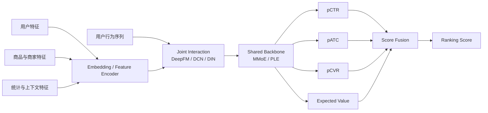
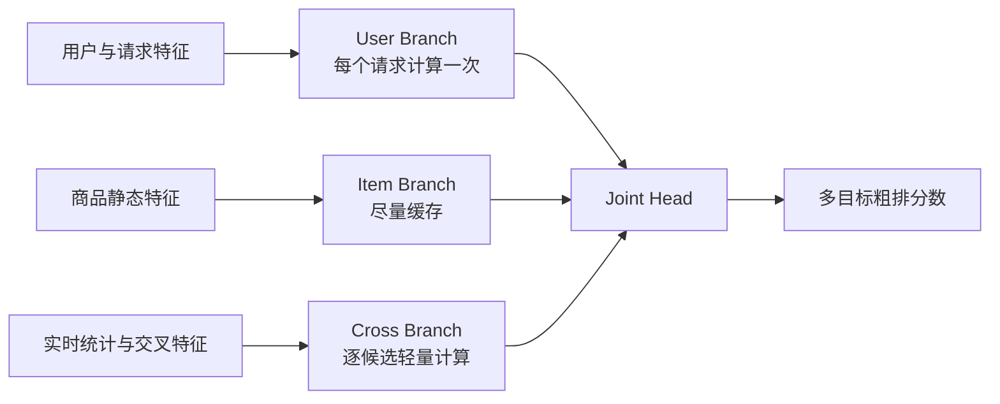

# 粗排与精排｜Pre-ranking and Ranking

<a name="top"></a>

## 目录

- [1. Stage-wise Funnel](#sec-1)
- [2. 粗排与精排的核心区别](#sec-2)
  - [2.1 为什么粗排经常使用 Two-Tower](#sec-2-1)
  - [2.2 召回双塔与粗排双塔的区别](#sec-2-2)
  - [2.3 从简单双塔到增强双塔](#sec-2-3)
  - [2.4 精排通常为什么不只使用 Two-Tower](#sec-2-4)
  - [2.5 精排能否使用“更强的 Two-Tower”](#sec-2-5)
  - [2.6 “Cross Two-Tower”与三分支粗排](#sec-2-6)
  - [2.7 模型选择对比](#sec-2-7)
- [3. 特征空间](#sec-3)
  - [3.1 不同决策面的排序设计](#sec-3-1)
- [4. 多任务预测](#sec-4)
  - [4.1 MMoE 结构](#sec-4-1)
  - [4.2 Shared-Bottom](#sec-4-2)
  - [4.3 MMoE 为什么能缓解任务冲突](#sec-4-3)
  - [4.4 PLE](#sec-4-4)
  - [4.5 多任务模型对比](#sec-4-5)
- [5. 多目标融合](#sec-5)
  - [5.1 Entire-space Modeling](#sec-5-1)
  - [5.2 Position Bias](#sec-5-2)
  - [5.3 融分不是简单相加](#sec-5-3)
  - [5.4 视频与直播的时长目标](#sec-5-4)
- [6. Calibration](#sec-6)
- [7. 粗排诊断](#sec-7)
  - [7.1 精排 Top-K 保留率](#sec-7-1)
  - [7.2 Teacher Consistency](#sec-7-2)
  - [7.3 Stage-wise Slice](#sec-7-3)
  - [7.4 粗排容量与模型能力的联动](#sec-7-4)
- [8. 离线与在线评估](#sec-8)
- [9. 常见误区](#sec-9)
- [10. Learning-to-Rank 目标](#sec-10)
- [11. 工业案例](#sec-11)
  - [11.1 短视频商品内容：内容消费与交易意图联合排序](#sec-11-1)
  - [11.2 直播内容流：动态房间与当前商品排序](#sec-11-2)
  - [11.3 商城商品卡：购买意图、价格与履约联合排序](#sec-11-3)
  - [11.4 搜索与类目浏览：相关性、个性化与交易价值分层](#sec-11-4)

---

<a name="sec-1"></a>

## 1. Stage-wise Funnel

```text
Thousands of recalled candidates
→ lightweight pre-ranking
→ hundreds of candidates
→ full ranking
→ tens of candidates
→ re-ranking
```

粗排优化“计算预算内的优质候选保留”，精排优化“当前用户、上下文和候选的多目标价值”。模型复杂度必须与候选规模和延迟预算匹配。

<a name="sec-2"></a>

## 2. 粗排与精排的核心区别

粗排和精排不是由某一个固定模型名称定义，而是由它们在级联系统中的职责和计算预算定义。

下表的候选规模是常见数量级而非固定标准；直播候选池可能远小于视频或商品池，但 online-state 校验和实时特征成本更高。

| 维度 | 粗排｜Pre-ranking | 精排｜Full Ranking |
|---|---|---|
| 输入规模 | 每次请求通常为数千个召回候选 | 通常为数百个粗排候选 |
| 输出规模 | 保留数百个候选进入精排 | 保留数十个候选进入重排 |
| 核心目标 | 尽量不误删精排认为有价值的候选 | 准确估计每个候选的多目标价值 |
| 单候选预算 | 很低，需要高吞吐 | 较高，可以使用复杂网络 |
| 常用特征 | 缓存特征、统计特征、轻量实时特征 | 完整用户、商品、上下文、序列和交叉特征 |
| 特征交互 | 点积、逐元素乘积或浅层 MLP | DeepFM、DCN、FiBiNET、Attention 等深度交互 |
| 用户序列 | 短序列、Pooling 或预计算兴趣向量 | DIN、DIEN、Transformer 等候选感知序列模型 |
| 预测任务 | 单目标或少量近似目标 | CTR、CVR、GMV、退款风险等多任务 |
| 常见模型 | Two-Tower、Small MLP、轻量 DCN、Distilled Student | DeepFM、DCN-V2、FiBiNET、DIN、MMoE、PLE |
| 训练重点 | Top-K Retention、Teacher Consistency、Latency | AUC、Log Loss、Calibration、NDCG 与业务价值 |
| 主要风险 | False Negative：优质候选被永久淘汰 | 多目标冲突、校准偏差和线上延迟 |

一个重要结论是：

> 粗排不追求独立完成最终排序，而是在固定计算成本下，尽可能保留精排 Top-K 候选。

一个直播电商请求可以这样理解这两层的分工：召回可能返回两千个在线 room session；粗排先用可缓存的主播/类目表示、轻量实时热度和基础用户兴趣留下三百个；精排再读取当前讲解商品、库存、价格、用户近期商品序列和房间实时状态，估计进房、有效观看、商品点击与交易价值。若一开始就让两千个候选都运行完整序列模型，延迟通常不可接受；若粗排只保留“当前最热门”的房间，精排又无法找回已经被删除的长尾高匹配候选。

商城商品卡同理：粗排更像低成本的候选保险丝，重点防止高购买价值 SKU 被误删；精排才负责区分“同类商品但价格、商家履约、库存和配送承诺不同”的细粒度价值。短视频商品内容还多一层内容—商品匹配：一个视频可能很吸引人，但其绑定商品未必适合当前用户。

<a name="sec-2-1"></a>

### 2.1 为什么粗排经常使用 Two-Tower

Two-Tower 将用户侧和商品侧分别编码：

```text
User Features → User Tower → user vector
Item Features → Item Tower → item vector

score = dot(user vector, item vector)
```

这种结构适合粗排，主要因为：

- 商品表示可以缓存或离线计算；
- 点积打分成本低，容易批量并行；
- 用户和商品网络可以独立控制复杂度；
- 能复用召回阶段已经训练好的 embedding；
- 面对数千候选时，延迟和吞吐更容易满足要求。

直觉上，用户塔把“这个用户此刻大致想要什么”压缩成向量，候选塔把“这个候选大致是什么”压缩成向量，点积衡量两个方向是否接近。例如用户近期连续浏览中低价护肤品，用户向量会靠近相应类目和价格带；一个绑定护肤商品的短视频、正在讲解护肤品的直播间或商城护肤商品卡，都可能获得较高粗排分数。但直播间是否仍在线、当前是否已经切换商品，以及商品是否缺货，不能只靠静态候选向量，需要实时特征或后续联合网络处理。

但纯 Two-Tower 的表达能力也有限。用户与商品在最终点积前独立编码，无法充分学习：

```text
用户价格偏好 × 当前商品价格
近期购买意图 × 候选商品类目
当前入口 × 商品内容形态
用户行为序列 × 候选商品
```

这些候选相关的精细交互通常是精排模型更擅长处理的部分。

<a name="sec-2-2"></a>

### 2.2 召回双塔与粗排双塔的区别

虽然二者都可能叫 Two-Tower，但使用方式并不完全相同。

| 维度 | 召回 Two-Tower | 粗排 Two-Tower |
|---|---|---|
| 比较范围 | 面向全量或超大商品库 | 只给召回返回的候选打分 |
| 商品向量 | 通常必须离线预计算并建立 ANN 索引 | 可以缓存，也可以在线补充少量特征 |
| 相似度 | 通常使用点积或 Cosine | 可使用点积、多目标点积或浅层融合 |
| 特征约束 | 必须保证商品侧可独立编码 | 可以加入更多请求级和实时特征 |
| 主要指标 | Recall@K、Coverage、ANN Latency | 精排 Top-K Retention、Pass Rate、Latency |
| 表达能力 | 受独立编码约束最强 | 可以比召回更复杂，但仍受吞吐限制 |

因此，粗排模型可以从召回双塔初始化，但通常会增加实时统计特征、多行为目标或更强的用户表示。

<a name="sec-2-3"></a>

### 2.3 从简单双塔到增强双塔

粗排中的模型复杂度可以逐级增加。

#### Level 1：纯双塔点积

```text
score = dot(user vector, item vector)
```

优点是速度最快、商品向量可缓存；缺点是用户—商品交互只有一个点积。

#### Level 2：多目标双塔

用户塔和商品塔产生共享表示，再为点击、加购或购买构造不同的投影空间：

```text
CTR score      = dot(user CTR vector, item CTR vector)
Purchase score = dot(user CVR vector, item CVR vector)
Value score    = weighted fusion of task scores
```

它比单目标双塔更接近电商价值，但任务之间仍缺少深度交互。

#### Level 3：双塔表示加轻量交互

在获得 `u` 和 `v` 后，构造：

```text
interaction = concat(u, v, u ⊙ v, u - v)
score = Small MLP(interaction)
```

这种模型比纯点积更强，可以学习非线性交互。由于必须逐候选运行 MLP，商品侧最终分数不能完全预计算，但在粗排候选规模下通常仍可能承受。

严格来说，一旦拼接两塔表示并共同输入 MLP，它就不再是完全可分离的纯 Two-Tower，而是“Two-Tower Encoder + Joint Interaction Head”。

#### Level 4：蒸馏粗排模型

使用精排作为 Teacher，让轻量粗排 Student 同时学习真实标签和精排知识：

```text
Student Loss
= label loss
+ teacher score matching loss
+ pairwise order consistency loss
```

蒸馏可以传递精排学到的复杂交互，但也可能复制 Teacher 的偏差。需要同时评估真实标签效果和精排 Top-K 保留率。

一个常见的混合目标为：

```math
\mathcal L_{student}=\lambda_y\mathcal L_{label}
+\lambda_s\mathcal L_{score}
+\lambda_r\mathcal L_{order}
```

Pointwise score distillation 拟合 teacher 的概率或 logit；pairwise/listwise distillation 拟合 teacher 在同一请求内的相对顺序。后者对 score scale 更稳健，但会丢失绝对概率信息。Teacher 候选必须来自粗排真实输入分布，否则只在 teacher 已经看过的头部候选上蒸馏会高估保留能力。

<a name="sec-2-4"></a>

### 2.4 精排通常为什么不只使用 Two-Tower

精排面对的候选更少，可以为每个 user-item pair 构建完整联合表示：



这类结构把用户、候选、上下文和统计特征送入联合网络，分别预估点击、互动或转化目标，再融合为最终排序分数。

精排通常组合多类模块，而不是只选择一个模型名：

| 建模问题 | 常用模块 | 解决什么问题 |
|---|---|---|
| 低阶与高阶特征交叉 | DeepFM、DCN、xDeepFM、FiBiNET | 学习用户、商品和上下文的组合关系 |
| 用户兴趣激活 | DIN | 找出与当前候选最相关的历史行为 |
| 兴趣演化 | DIEN、Transformer | 建模兴趣随时间的变化 |
| 多任务关系 | Shared-Bottom、MMoE、PLE | 同时预测多个行为并控制任务冲突 |
| 漏斗概率 | ESMM | 建模曝光、点击和购买之间的条件关系 |
| 最终价值 | Score Fusion、LTR | 将多任务预测转为排序决策 |

<a name="sec-2-5"></a>

### 2.5 精排能否使用“更强的 Two-Tower”

可以，但需要看“更强”具体指什么：

- 更深的用户塔和商品塔：仍属于纯 Two-Tower，适合表示学习，但交互上限没有改变；
- 多向量表示：用多个兴趣向量匹配商品，可提升多兴趣表达；
- Late Interaction：保留多个 token 或 field vector，再做 MaxSim/Attention；
- 两塔输出后接 Cross Network 或 MLP：表达更强，但已成为联合交互模型；
- Cross-Attention：用户序列与候选深度交互，通常属于精排而不是传统双塔。

所以更准确的理解是：

```text
召回：独立编码必须保留，才能面向全库检索
粗排：通常保持大部分可分离结构，加入轻量交互
精排：允许充分联合交互，不再要求商品分数可预计算
```

<a name="sec-2-6"></a>

### 2.6 “Cross Two-Tower”与三分支粗排

`Cross Two-Tower` 不是定义统一的标准模型名。实际讨论中，它可能指塔内交叉、双塔后的联合 head，或用户/商品/交叉三分支模型。看到这个名称时，应先问：交叉特征在哪里计算，哪些表示可以缓存，哪些网络必须逐候选运行？

#### 2.6.1 塔内交叉仍是可分离双塔

```text
User features → DCN / MLP → u
Item features → DCN / MLP → v
score = dot(u, v)
```

Cross 只发生在同一实体内部，例如 `用户活跃度 × 用户价格偏好` 或 `商品类目 × 折扣`。用户塔仍看不到候选，item 向量仍可预计算，所以可用于召回和粗排；它并没有解决细粒度 user-item interaction 上限。

#### 2.6.2 双塔编码器加联合交互 head

```text
u = UserTower(user features)
v = ItemTower(item features)
h = concat(u, v, u ⊙ v, abs(u-v), cross_features)
score = SmallMLP(h)
```

塔输出可以缓存，但 MLP 必须逐候选执行。它比点积双塔更强，常用于强粗排或轻量精排；若进一步加入 DIN 或 Cross-Attention，成本通常更接近精排。

#### 2.6.3 用户、商品、交叉三分支

一些粗排系统把特征按计算复用方式拆成三部分：



其请求级成本可粗略写为：

```math
C_{request}\approx C_{user}+N(C_{cross}+C_{head})+N_{miss}C_{item}
```

`N` 是粗排候选数，`N_miss` 是 item cache 未命中的数量。因此用户分支可以较深，商品分支可以依赖缓存；交叉分支和上层 head 必须足够轻，因为它们会被执行 `N` 次。

公开资料中的 COLD 是相近的算法—系统协同思路：不再强制粗排只能使用向量点积，而是在算力预算内联合考虑特征选择、轻量模型结构、推理加速及在线训练与服务协同。它不是一个具有唯一结构的 canonical three-tower，也不应简单称为“更强 Two-Tower”；更准确的定位是计算成本约束下的粗排模型—系统协同设计。

#### 2.6.4 阶段定位

| 结构 | 当前候选进入联合网络 | 可缓存部分 | 常见阶段 | 主要边界 |
|---|---:|---|---|---|
| 塔内 DCN + 点积 | 否 | 完整 item 向量 | 召回、粗排 | 只有晚期点积交互 |
| Two-Tower + Small MLP | 是 | 两塔输出 | 粗排、轻量精排 | head 逐候选执行 |
| 用户/商品/交叉三分支 | 是 | item 分支、部分统计 | 强粗排 | 需精细控制 cache miss 与 cross 特征成本 |
| DeepFM/DCN/DIN Joint Model | 是 | embedding 与少量中间结果 | 精排 | 表达强但单候选成本高 |
| Cross-Attention / list context | 是 | 很有限 | 精排、后置精排 | 通常无法承受数千候选 |

最稳妥的模型谱系是：

```text
可分离点积模型
→ 缓存双塔表示 + 轻量逐候选交互
→ 三分支/计算感知粗排
→ 完整联合精排模型
```

<a name="sec-2-7"></a>

### 2.7 模型选择对比

| 模型方案 | 交互能力 | 计算成本 | 商品表示可预计算 | 更常见阶段 | 主要优点 | 主要缺点 |
|---|---:|---:|---:|---|---|---|
| LR / GBDT | 低 | 低 | 部分可以 | 粗排基线 | 快、稳定、容易解释 | 难建模复杂语义和序列 |
| Pure Two-Tower | 低到中 | 很低 | 是 | 召回、粗排 | 高吞吐，易缓存 | 深度交互不足 |
| Multi-task Two-Tower | 中 | 低 | 是或部分可以 | 粗排 | 同时近似多个目标 | 任务与候选交互仍有限 |
| Two-Tower + Small MLP | 中 | 中低 | 仅两塔表示可缓存 | 粗排、轻量精排 | 性价比高，表达强于点积 | 需要逐候选联合计算 |
| 三分支 / Compute-aware DNN | 中到高 | 可控 | 用户/item 分支可复用 | 强粗排 | 能使用实时统计和 user-item cross | 特征成本、cache 与模型需协同设计 |
| Small DeepFM / DCN | 中到高 | 中 | 否 | 强粗排、轻量精排 | 能显式建模特征交叉 | 候选多时成本上升 |
| DIN / DIEN | 高 | 高 | 否 | 精排 | 候选感知的兴趣建模 | 序列计算和特征服务昂贵 |
| MMoE / PLE Backbone | 高 | 高 | 否 | 精排 | 建模多任务共享与冲突 | 参数、训练和服务复杂 |
| Cross-Attention / Transformer | 很高 | 很高 | 否 | 精排、后置精排 | 深度建模候选与序列关系 | 延迟和显存成本最高 |

阶段与模型并不是绝对绑定。候选规模较小、延迟预算充足时，粗排也可以使用 Small DCN；业务规模极大或延迟严格时，精排也可能采用增强双塔。最终选择取决于单位候选成本与端到端收益。

<a name="sec-3"></a>

## 3. 特征空间

- Buyer：ID/segment、长期偏好、近期行为、价格敏感度；
- Product：ID、类目、品牌、价格、折扣、库存、新鲜度；
- Seller：质量、履约、历史转化和风险信号；
- Content：作者、内容形态、语义和质量；
- Context：市场、入口、session、位置、时间与设备；
- Cross/sequence：buyer × product、query/context × product、LastN 行为。

任何线上特征都要检查训练—服务一致性、可用时间点和缺失 fallback，避免 label leakage。

<a name="sec-3-1"></a>

### 3.1 不同决策面的排序设计

| 决策面 | 精排候选 | 最关键的特征交互 | 典型任务 | 特殊偏差与护栏 |
|---|---|---|---|---|
| 短视频商品内容流 | 视频 | 用户序列 × 视频语义、内容 × 绑定商品、视频时长 × 播放行为 | 有效播放、完播/跳过、互动、商品点击、下单、支付 | 时长偏差、位置与自动播放偏差、内容消费与交易目标冲突 |
| 直播内容流 | 在线 room session | 用户历史商品/主播 × 当前主播/商品集合、实时热度 × 房间状态 | 进房、有效观看、互动、商品点击、加购、支付 | room 状态陈旧、热度反馈环、当前商品快速切换、库存与下播 |
| 商城商品卡 | SKU/SPU/offer | 价格偏好 × 当前价格、类目/品牌意图 × 商品、用户 × 商家履约 | PDP、加购、下单、支付、净成交、退款/取消 | 价格与促销选择偏差、缺货、同款多 offer、延迟转化 |
| 搜索与类目浏览 | 满足查询与筛选条件的 SKU/SPU/offer | 查询词项 × 商品属性、查询语义 × 商品内容、用户任务 × 价格带 | 相关性、PDP、加购、支付、查询改写 | 明确约束被个性化覆盖、位置偏差、零结果与长尾查询稀疏 |
| 商品详情页关联推荐 | 替代商品、互补商品或解释内容 | 当前商品 × 候选关系、购买阶段 × 关系类型、用户历史 × 候选 | 继续浏览、加购、连带购买、成熟净价值 | 替代与互补时机不同、同款重复、当前页本身由旧策略选择 |
| 创作者选品 | 商品、商家 offer 或合作机会 | 创作者内容主题 × 商品、受众价格带 × 商品价格、历史合作 × 当前库存 | 查看、收藏/申请、接受、发布、成熟交易 | 创作者容量、合作资格、接受与发布之间的选择偏差、跨创作者干扰 |

不同决策面可以共享 embedding、底层 experts 或商品内容编码器，但不应机械共享全部 task head 和最终融分：内容观看、直播进入、商品购买、搜索相关性和合作接受的标签条件、成熟窗口与机会成本不同。共享模型时应加入 scenario-conditioned gate/head，并分别检查校准。

<a name="sec-4"></a>

## 4. 多任务预测

电商排序常同时估计：

```text
pCTR, pPDP, pATC, pOrder, pPay, expected AOV, pRefund
```

MMoE 使用共享 experts 和任务特定 gates，在共享信息的同时减少任务冲突。需要监控 negative transfer：一个目标提升可能损害另一个目标。

<a name="sec-4-1"></a>

### 4.1 MMoE 结构

设第 `k` 个 expert 输出为 `E_k(x)`，任务 `t` 的 gate 为 `g_t(x)`：

```math
h_t(x)=\sum_{k=1}^{K}g_{t,k}(x)E_k(x),\qquad
g_t(x)=\text{softmax}(W_t x)
```

每个任务再用独立 tower 输出预测。Gate 允许点击和购买任务以不同权重组合共享专家。

```python
class MMoE(nn.Module):
    def __init__(self, input_dim, hidden_dim, num_experts, num_tasks):
        super().__init__()
        self.experts = nn.ModuleList([
            nn.Sequential(nn.Linear(input_dim, hidden_dim), nn.ReLU())
            for _ in range(num_experts)
        ])
        self.gates = nn.ModuleList([
            nn.Linear(input_dim, num_experts) for _ in range(num_tasks)
        ])
        self.towers = nn.ModuleList([
            nn.Linear(hidden_dim, 1) for _ in range(num_tasks)
        ])

    def forward(self, x):
        experts = torch.stack([expert(x) for expert in self.experts], dim=1)
        outputs = []
        for gate, tower in zip(self.gates, self.towers):
            weights = torch.softmax(gate(x), dim=1).unsqueeze(-1)
            task_hidden = (experts * weights).sum(dim=1)
            outputs.append(torch.sigmoid(tower(task_hidden)))
        return outputs
```

训练时常使用加权多任务损失 `L = Σ λ_t L_t`。稀疏购买任务的权重、样本率和梯度大小需要共同检查，不能只凭业务重要性机械放大 `λ_t`。

<a name="sec-4-2"></a>

### 4.2 Shared-Bottom

最基础的多任务结构是共享底层表示、每个任务使用独立 tower：

```math
h=f_{shared}(x),\qquad
\hat{y}_t=f_t(h)
```

```math
\mathcal L=\sum_{t=1}^{T}\lambda_t\mathcal L_t
```

优点是参数和计算效率高；缺点是所有任务被迫共享同一个表示，当 CTR 与 CVR 的最优特征方向不同，会产生 negative transfer。

<a name="sec-4-3"></a>

### 4.3 MMoE 为什么能缓解任务冲突

MMoE 的每个任务都有独立 gate，但共享 experts。若任务相关，gate 可以复用相同 experts；若任务冲突，gate 可以选择不同 experts。因此它比 Shared-Bottom 更灵活。

局限包括：

- Experts 仍完全共享，任务专属模式只能通过 gate 间接形成；
- Gate 可能塌缩到少数 experts，导致 expert utilization 不均衡；
- Expert 数、hidden dimension 和任务损失权重共同影响结果；
- MMoE 缓解而非消除 negative transfer。

可监控每个任务的平均 gate entropy 与 expert load：

```math
H(g_t)=-\sum_k g_{t,k}\log g_{t,k}
```

Entropy 过低可能表示 gate 过早塌缩；但高度集中也可能是合理的任务专门化，需要结合效果判断。

缓解极化可以尝试 gate dropout、entropy/load-balancing regularization、降低 gate 温度敏感性或减少冗余 experts。不能只用“每个 expert 都被平均使用”作为目标：合理的任务专门化本来就可能不均匀。更可靠的诊断是同时看 gate entropy、expert 梯度/负载、不同随机种子的稳定性和各任务 Pareto 变化。

<a name="sec-4-4"></a>

### 4.4 PLE

Progressive Layered Extraction 同时设置 shared experts 与 task-specific experts。第 `l` 层任务 `t` 的表示为：

```math
h_t^{(l)}=g_t^{(l)}(
E_{t,1}^{(l)},\ldots,E_{t,K_t}^{(l)},
E_{s,1}^{(l)},\ldots,E_{s,K_s}^{(l)}
)
```

任务 gate 可以选择专属 experts 和共享 experts；多层 CGC（Customized Gate Control）逐步分离共享信息与任务特定信息。

相比 MMoE：

- 优势：显式保留 task-specific capacity，通常更能控制 negative transfer；
- 局限：结构、参数和调参复杂度更高，任务很多时成本明显；
- 适用：任务相关性不均衡、任务冲突强且精排预算充足。

<a name="sec-4-5"></a>

### 4.5 多任务模型对比

| 模型 | 共享方式 | Task-specific capacity | 优点 | 缺点 |
|---|---|---:|---|---|
| Separate Models | 不共享 | 强 | 无 negative transfer，易独立迭代 | 重复计算，无法利用任务相关性 |
| Shared-Bottom | 共享单一底层 | 仅 tower | 简单、便宜、稳定 | 容易 negative transfer |
| MMoE | 共享多个 experts，task gate 选择 | 间接 | 参数效率与任务分离的折中 | Experts 仍共享，可能 gate collapse |
| PLE | Shared + task-specific experts | 强 | 更精细地分离共享/专属知识 | 参数、服务和调参成本高 |

模型选择不应只看某个任务 AUC。需要检查 Pareto trade-off：一个方案若提升 CTR 却显著损害购买或订单质量，可能只是沿任务冲突方向移动。

<a name="sec-5"></a>

## 5. 多目标融合

简化价值分解：

```text
Expected GMV ≈ pClick × pPurchase|Click × expected order value
```

线上 score 还可能加入用户价值、订单质量、新鲜度和风险约束。融合方法包括加权和、乘法、约束优化或学习排序。无论形式如何，都要回答：

- 权重对应什么业务 trade-off？
- 各任务是否校准、量纲是否稳定？
- score 改动是否改变价格带、类目和商家分布？
- 离线目标是否与在线 primary metric 对齐？

<a name="sec-5-1"></a>

### 5.1 Entire-space Modeling

如果 CVR 只在点击样本上训练，会产生 sample-selection bias；同时购买样本远少于曝光样本。Entire-space 方法可分解：

```math
P(\text{purchase}\mid\text{impression})
=P(\text{click}\mid\text{impression})
\times P(\text{purchase}\mid\text{click})
```

这样可在全曝光空间学习 `pCTR` 和 `pCTCVR`，再约束概率关系。该分解要求目标转化必然经过并归因到所定义的点击，即 `purchase` 是 `click` 的子事件；若存在 View-through、跨页面或无点击购买，应增加对应路径或改用更完整的漏斗模型。分析时还必须明确 CVR 的条件分母：曝光、点击、PDP 访问还是订单。

ESMM 的典型联合目标为：

```math
\mathcal L=\mathcal L_{CTR}(y,\hat{p}_{CTR})+
\mathcal L_{CTCVR}(y\cdot z,\hat{p}_{CTR}\hat{p}_{CVR})
```

其中 `y` 表示点击，`z` 表示点击后的转化。模型不直接在全曝光空间监督 CVR，而是通过 `pCTCVR=pCTR×pCVR` 间接学习。

优势：

- 使用全曝光样本训练，缓解 clicked-sample selection bias；
- CTR 与 CVR embedding 共享，缓解转化标签稀疏。

局限：

- `pCVR=pCTCVR/pCTR` 可能产生数值放大与概率偏差；
- CTR 与 CVR 的共享可能引入任务冲突；
- 曝光但未点击的样本并没有可观测的真实 post-click conversion label；
- 它解决的是漏斗建模问题，不是通用的多任务专家结构，和 MMoE/PLE 并非互斥。

实践中可以用 ESMM 定义漏斗概率关系，再用 MMoE 或 PLE 作为底层表示结构。

<a name="sec-5-2"></a>

### 5.2 Position Bias

训练日志来自旧排序策略，靠前商品更容易获得点击。常见处理包括 position feature、inverse propensity weighting、随机探索数据和 counterfactual learning。

```math
\mathcal{L}_{IPW}=\sum_i \frac{o_i}{\pi_i}\ell(y_i,\hat{y}_i),
\qquad
\pi_i=P(o_i=1\mid u_i,item_i,\text{logging policy})
```

这里 `o_i` 表示该候选被 Logging Policy 纳入可观测日志的指示变量，`pi_i` 是对应的非零 Propensity。只有在 Position-Based Model 等额外假设成立时，才可把 Propensity 简化为仅依赖位置；若 `o_i` 被解释为无法直接观测的 Examination，公式不能直接计算。IPW 在 Propensity 很小时方差会很大，实践中通常需要 clipping 或 self-normalization，并报告由此改变的偏差—方差权衡。

<a name="sec-5-3"></a>

### 5.3 融分不是简单相加

若所有 head 已校准且量纲可控，加权和为：

```math
S(u,i)=\sum_t w_t f_t(\hat p_t)+w_v\widehat{V}(u,i)-w_r\widehat{Risk}(u,i)
```

`f_t` 可以是概率、logit、分位数或分桶后的单调变换。乘法更贴合漏斗，但对接近零和校准误差敏感：

```math
S_{trade}=\hat p_{click}\cdot
\hat p_{purchase\mid click}\cdot
\widehat{E}[NetValue\mid purchase]
```

也可使用带平滑的乘积并在 log 空间实现：

```math
\log S=\sum_t w_t\log(\epsilon+\hat p_t)+
\gamma\log(\epsilon+\widehat{Value}_{+})
```

`Value_+` 必须是非负且经过尺度控制的价值项。若 Net Value 可能为负，应把退款、补贴或风险作为独立减项，或使用定义域明确的单调变换，不能直接取对数。加权和允许一个目标补偿另一个目标，乘法会强烈惩罚任一漏斗环节的低分。选择哪种形式取决于决策语义，而不是哪种离线 AUC 更高。融合前必须明确每个概率的条件分母；把 `pPurchase|click` 当作 `pPurchase|impression` 会重复或遗漏 CTR。

<a name="sec-5-4"></a>

### 5.4 视频与直播的时长目标

直接回归播放秒数容易被视频长度和长尾分布支配。一种工业化做法是对正例按观看时长加权做 logistic learning：

```math
\mathcal L_i=-[w_i y_i\log p_i+(1-y_i)\log(1-p_i)]
```

在低正例率、特定采样和加权构造等假设下，预测概率的 odds `p/(1-p)` 可近似作为期望时长的单调代理；对应的 logit 是 `log(p/(1-p))`。离开这些条件不能直接等同。它也不是天然无偏的“满意度”：长视频拥有更高的可观察时长上限，自动播放、网络状态和视频长度还会同时影响曝光与观看。实践中应联合使用有效播放、播放比例、跳过、显式互动，并按时长桶做校准或使用分位数/反事实时长目标。

直播停留时长还存在右删失：用户仍在房间、直播下播或统计窗口结束时，真实最终停留尚不可见。训练样本应定义成熟窗口或使用 survival/hazard 视角，不能把未成熟样本直接当作短停留负例。

<a name="sec-6"></a>

## 6. Calibration

AUC 衡量相对排序能力，不保证概率准确。对价值乘积和跨场景阈值而言，calibration 尤其重要。

建议按市场、位置、类目和用户阶段检查：

- predicted vs observed rate；
- reliability curve / calibration error；
- score distribution 与 saturation；
- 新老模型的分布漂移。

若训练时保留全部正例、仅以比例 `rho` 保留负例，模型在采样数据上的预测为 `q`，原分布概率可按先验比例恢复：

```math
p=\frac{\rho q}{1-q+\rho q}
```

这个公式要求采样率已知且在所讨论 slice 内近似稳定。若按市场、位置、行为或难度使用不同采样率，应逐样本加权或分层校准；只用一个全局系数会造成局部概率失真。Platt scaling、isotonic regression 等后校准也必须使用未被同样采样扭曲的验证集。

```python
def expected_calibration_error(y_true, y_prob, bins=10):
    edges = np.linspace(0.0, 1.0, bins + 1)
    bucket = np.clip(np.digitize(y_prob, edges) - 1, 0, bins - 1)
    ece = 0.0
    for b in range(bins):
        mask = bucket == b
        if mask.any():
            ece += mask.mean() * abs(y_true[mask].mean() - y_prob[mask].mean())
    return ece
```

ECE 依赖分桶方式，最好同时展示 reliability diagram，并按关键 slice 检查，而不是只给一个全局数字。

<a name="sec-7"></a>

## 7. 粗排诊断

粗排模型更便宜，但错误淘汰不可逆。重点指标包括：

- candidate pass rate；
- full-rank Top-K retention；
- 高 GMV/高购买概率候选保留率；
- 各召回通道、类目、价格带和新商品的 pass mix；
- inference latency、timeout 与 fallback。

蒸馏精排分数时，要检查 teacher bias 是否固化旧策略偏差。

<a name="sec-7-1"></a>

### 7.1 精排 Top-K 保留率

先在同一批召回候选上运行粗排和精排 Teacher，检查精排最看重的候选有多少被粗排保留：

```text
Full-rank Top-K Retention
= 精排 Top-K 中被粗排保留的商品数
  ÷ 精排 Top-K 商品数
```

例如精排 Top-100 中只有 82 个进入粗排输出，则 Retention 为 82%。它比单独计算粗排 AUC 更贴近粗排在级联系统中的真实职责。

需要同时观察多个 `K`：

```text
Top-50 Retention
Top-100 Retention
Top-200 Retention
```

如果只看较大的 K，可能掩盖最头部高价值候选被误删的问题。

<a name="sec-7-2"></a>

### 7.2 Teacher Consistency

蒸馏粗排模型还可以检查：

| 指标 | 含义 |
|---|---|
| Score Correlation | Student Score 与 Teacher Score 的相关性 |
| Pairwise Agreement | 两个模型对候选对先后顺序的一致率 |
| NDCG against Teacher | 将 Teacher 排序视为软标签后的列表一致性 |
| Top-K Overlap | Student 与 Teacher 头部候选的交集比例 |
| Business-weighted Retention | 对 Teacher 高 GMV 或高购买价值候选给予更高权重 |

Teacher Consistency 不是最终目标。Student 可能与 Teacher 非常一致，却共同继承旧模型的曝光偏差。因此仍需保留真实行为标签和在线实验。

<a name="sec-7-3"></a>

### 7.3 Stage-wise Slice

粗排平均保留率正常，也可能系统性淘汰某些供给。至少按以下维度切片：

- 召回通道与通道交集；
- 新老商品和商品年龄；
- 类目、商家层级与价格带；
- 新老用户和活跃度；
- 市场、入口、设备与网络条件；
- 高 CTR、高 CVR、高 AOV 和低退款候选。

<a name="sec-7-4"></a>

### 7.4 粗排容量与模型能力的联动

粗排输出数量增加，通常会提高精排 Top-K Retention，但也增加精排计算量。因此应联合比较：

```text
粗排输出候选数
× 精排单候选推理成本
× 请求 QPS
→ 精排总计算成本
```

模型升级与候选数扩容是两种不同方案。更强的粗排模型可能在候选数不变时提高 Retention；直接扩大候选数则可能以更高精排成本换取效果。

<a name="sec-8"></a>

## 8. 离线与在线评估

粗排离线评估：Top-K Retention、Teacher NDCG、Pairwise Agreement、Recall Channel Slice、P95/P99 Latency 和 Throughput。

精排离线评估：AUC、PR-AUC、Log Loss、NDCG、Calibration、关键 Slice、推理延迟和特征获取成本。

在线：CTR、ATC、CVR、AOV、Gross/Net GMV、取消/退款、留存、seller/item coverage 和系统护栏。

离线提升只说明值得进入实验。最终上线依据见 [A/B Testing](./ab-testing.md) 和 [Ramp-up](./ramp-up.md)。

<a name="sec-9"></a>

## 9. 常见误区

- 只看全量 AUC，忽略正例稀疏任务和关键 slice；
- 将 CTR 当作交易价值的充分代理；
- 分析精排却忽略召回/粗排候选集变化；
- 使用订单后才可见的特征造成泄漏；
- 新模型 Score Scale 改变，旧重排阈值仍直接复用；应先在代表线上目标分布的未偏置验证集，或已按 Sampling/Propensity 一致校正的验证集上重做概率 Calibration 与 Utility Normalization，再用固定候选回放验证或调优 MMR Lambda、DPP Alpha 和 Relevance Floor。若 Utility Contract 未变，参数未必必须改变；若 Similarity Kernel 也改变，则必须同时复核 Similarity Scale；
- 模型平均收益为正，却损害关键市场或新用户。
- 认为粗排一定是 Two-Tower、精排一定是某个固定深度模型；
- 使用粗排 AUC 代替精排 Top-K Retention；
- 只比较模型参数量，不比较相同 QPS 和延迟预算下的效果；
- 将 Two-Tower 后的 Joint MLP 仍理解为完全可离线检索的纯双塔；
- 蒸馏时只拟合 Teacher Score，忽略真实标签和 Teacher Bias。

<a name="sec-10"></a>

## 10. Learning-to-Rank 目标

排序损失可以分为：

| 类型 | 学习对象 | 代表方法 | 特点 |
|---|---|---|---|
| Pointwise | 单个候选的标签/概率 | BCE、MSE | 简单，可自然支持多任务 |
| Pairwise | 正负候选的相对顺序 | BPR、hinge loss | 直接优化相对偏好 |
| Listwise | 整个候选列表 | ListNet、LambdaLoss | 更贴近 NDCG，但训练更复杂 |

BPR 的基本形式为：

```math
\mathcal{L}_{BPR}=-\log\sigma(s(u,i^+)-s(u,i^-))
```

损失函数的选择应与线上展示方式、标签可靠性和最终业务目标一致。

<a name="sec-11"></a>

## 11. 工业案例

以下候选规模和变化幅度均为示例。这里重点说明粗排与精排承担不同计算预算：先用阶段保留证据判断损失发生在哪里，再在相同候选规模、特征可用性和延迟预算下比较模型。

<a name="sec-11-1"></a>

### 11.1 短视频商品内容：内容消费与交易意图联合排序

- **现象（示例）**：每次请求从约 3,000 条召回视频压缩到 400 条粗排候选，再取 80 条进入精排。精排升级后离线支付 NDCG@20 提升 2.3%，线上却没有增量；Oracle 回放发现，最终高支付价值视频有 42% 已在粗排被删除。
- **定位证据**：为同一候选保存召回来源、粗排分数、是否通过、精排 teacher 分数和最终标签。比较各召回通道的 Teacher Top-K Retention，并将损失拆成“未召回”“粗排删除”“精排顺序”和“重排改变”；精排模型无法评价未进入其候选集的视频。
- **候选方案或模型对比**：粗排比较标准 Two-Tower、带轻量实时分支的增强 Two-Tower，以及蒸馏精排多目标分数的 Small DCN；精排在相同 80 条候选上比较 DCN、DIN 与 MMoE/PLE。粗排优先选择单位延迟下保留率高的方案，精排再比较候选感知交互和多任务冲突。
- **为何有效**：蒸馏使粗排近似下游对内容和交易价值的联合判断，避免只按观看目标提前淘汰交易候选；精排只在较小集合上使用 DIN 和多任务结构，从而把交互表达能力放在可承受的阶段。
- **离线指标**：各阶段 Teacher Top-K Retention、Recall-source Retention、支付/商品点击 NDCG、各任务 PR-AUC、Log Loss、ECE，以及不同候选规模下的 latency–quality frontier。
- **在线指标**：Qualified View、Product Clicks per Eligible User、支付买家率、成熟净价值、负反馈、粗排/精排 P95/P99 latency、Timeout 和 Fallback Rate。
- **失败边界**：teacher 若依赖曝光后的特征，蒸馏会继承泄漏；支付标签过稀时 shared representation 可能仍被观看任务主导；候选绑定或库存过期属于可用性问题，不能由更复杂精排修复。

<a name="sec-11-2"></a>

### 11.2 直播内容流：动态房间与当前商品排序

- **现象（示例）**：直播粗排只使用用户与主播的缓存 embedding，候选从 1,200 个房间压缩到 150 个。对当前商品加入强交互的精排虽然使有效观看 PR-AUC 提升 1.1%，但精排 Top 50 中仍有 8% 在曝光前切换为不相关商品，另有 4% 已下播或售罄。
- **定位证据**：把 candidate identity 拆为主播、room session 和请求时当前商品，分别统计粗排保留、精排校准与曝光前有效率；按 Feature Age 和商品切换后 1/5/10 分钟切片。若用户—主播匹配稳定、用户—当前商品残差恶化，问题在动态候选表示而非永久主播偏好。
- **候选方案或模型对比**：粗排比较纯用户—主播 Two-Tower、用户—room-session Two-Tower，以及增加当前商品向量和状态门控的增强双塔；精排比较 Wide & Deep、DIN+MMoE 与 DIN+PLE，任务包括进房、有效观看、商品点击和支付。所有模型都在曝光前执行独立的实时 Eligibility 复核。
- **为何有效**：粗排中的当前商品分支提高动态候选保留率，精排的候选感知序列再区分“喜欢主播”和“喜欢本场商品”；Eligibility 复核把模型价值判断与房间是否仍可服务分开。
- **离线指标**：当前商品相关候选 Retention、各任务 PR-AUC/Log Loss/ECE、商品切换切片、下播/售罄候选率、模型 FLOPs 和批量推理时间。
- **在线指标**：Valid-at-exposure Rate、Qualified Entry、Quick Exit、当前商品点击、支付买家率、成熟净价值、Feature Age、P99 latency 和 Fallback Share。
- **失败边界**：模型不能补救慢于商品切换的特征管道；最终整场热度或未来商品序列不能回填；热门房间热度带有旧策略曝光偏差，直接作为强特征会形成反馈环。

<a name="sec-11-3"></a>

### 11.3 商城商品卡：购买意图、价格与履约联合排序

- **现象（示例）**：单任务点击模型上线候选的离线 AUC 提升 0.6%，商品卡 CTR 提升 7%，但 Paid Buyers per Eligible User 下降 3%，成熟退款率增加 1.5 个百分点。增长主要来自低价强促销 offer，而其配送和履约质量较弱。
- **定位证据**：按价格带、折扣、SPU/SKU/offer、商家履约和用户购买意图分解点击到支付漏斗；比较点击分数与支付、退款校准。若点击提升集中在低价切片，而 PDP-to-Pay 和成熟净价值下降，根因是目标错配而非模型容量不足。
- **候选方案或模型对比**：以单任务 DeepFM 为基线；比较 ESMM 对整个曝光到支付空间建模、MMoE 的任务专家共享和 PLE 的逐层任务分离。粗排使用支付/净价值 teacher 蒸馏的 Two-Tower 或 Small DeepFM，精排再融合点击、加购、支付和预期退款价值。
- **为何有效**：Entire-space Modeling 减少只在点击样本上训练 CVR 的选择偏差，多任务模型利用高频点击信号同时保留支付和退款目标；价值融合避免高点击但低质量的 offer 仅凭前段指标占优。
- **离线指标**：PDP、加购、支付和退款任务的 PR-AUC、Log Loss、ECE；支付 teacher Top-K Retention；分价格带与商家质量校准；任务梯度冲突和模型延迟。
- **在线指标**：Product-card CTR、PDP-to-Pay、Paid Buyers per Eligible User、成熟净价值、取消/退款率、Out-of-stock Exposure、Seller Concentration 和 P99 latency。
- **失败边界**：退款标签未成熟时不能把缺失当作 0；多任务权重若按实验结果反复调整会造成选择偏差；SPU、SKU、offer 粒度混用会同时破坏标签、去重和校准。

<a name="sec-11-4"></a>

### 11.4 搜索与类目浏览：相关性、个性化与交易价值分层

- **现象（示例）**：搜索排序直接使用商品卡支付价值模型后，整体支付额提升 3%，但包含品牌或规格词的查询中，Top 10 属性匹配率下降 6 个百分点，查询改写率上升 9%。模型偏向高转化头部商品，却把“37 码”“无糖”等明确条件当作可被交易价值补偿的软信号。
- **定位证据**：把查询拆为品牌、类目、属性、规格和否定约束，并按约束数量、查询频次与用户历史强度分析排序残差。若高价值商品分数正常、但违反硬约束的候选仍进入前列，根因是相关性与价值缺少阶段隔离，而不是单纯模型容量不足。
- **候选方案或模型对比**：粗排使用 lexical/semantic relevance Two-Tower 或轻量 Cross Two-Tower，在满足硬约束的候选内保留相关商品；精排比较 LambdaMART、DCN+MMoE 与序列模型，分别预测相关性、详情页点击、加购和支付。硬条件由 eligibility 或约束层保证，最终融分只在合格集合内做相关性、个性化和价值权衡。
- **为何有效**：相关性层回答“这个商品是否在回答查询”，价值层回答“在相关商品中哪个更适合当前用户”。将二者分层可以防止高转化头部商品越过明确意图，同时允许个性化在同等相关候选之间发挥作用。
- **离线指标**：Query NDCG、Attribute Match Rate、Pairwise Accuracy、各任务 PR-AUC/Log Loss/ECE、约束数量切片、长尾查询切片、粗排 Top-K Retention 和推理成本。
- **在线指标**：Zero-result Rate、Reformulation Rate、PDP per Searcher、加购/支付买家率、成熟净价值、无关结果负反馈、P99 latency 和 Fallback Share。
- **失败边界**：点击标签带有旧排序的位置偏差，不能等同于人工相关性；未来改写词不能进入当前请求特征；价格、折扣和可售性变化快于特征更新时，模型结构升级不会修复陈旧候选。对明确筛选条件的放宽必须可观测且单独评估，不能由黑盒分数隐式决定。


模型细节：[特征交叉](./feature-interaction.md)、[用户行为序列](./user-behavior-sequence.md)、[重排](./reranking.md)。
