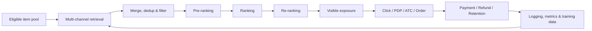
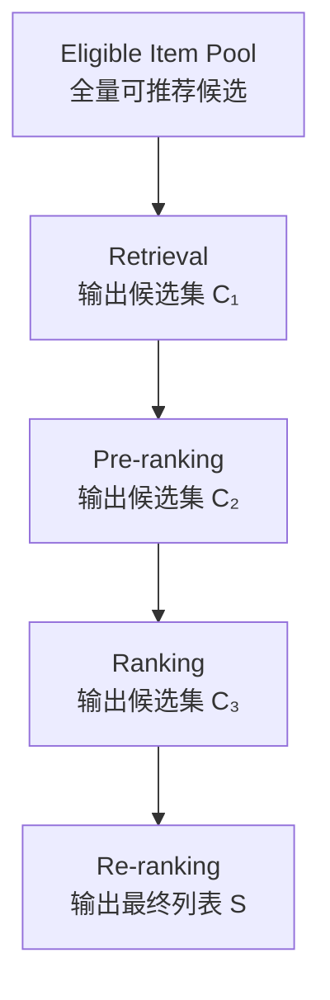

# 电商推荐系统链路｜E-commerce Recommendation System Pipeline

<a name="top"></a>

本文聚焦电商推荐系统的端到端链路、阶段接口和诊断方法，并提供各算法专题的阅读入口。这里的“item”不是固定等于商品：它可以是短视频、正在直播的房间、商品卡、搜索结果、商品详情页中的内容，也可以是一条创作者—商品关系；先定义推荐对象，才能定义标签、候选池和指标分母。

## 目录

- [1. 从业务目标到反馈闭环](#sec-1)
  - [1.1 不同决策面的对象边界](#sec-1-1)
  - [1.2 每个阶段优化什么](#sec-1-2)
  - [1.3 一次请求如何穿过整条链路](#sec-1-3)
- [2. 阶段职责与分析重点](#sec-2)
- [3. 多目标价值](#sec-3)
- [4. 一次请求中的关键数据接口](#sec-4)
- [5. 线上异常的链路化诊断](#sec-5)
- [6. 主题文档](#sec-6)
- [7. 从离线到上线](#sec-7)
- [8. 工业案例：沿阶段漏斗定位损失](#sec-8)
  - [8.1 短视频商品内容：离线排序变好，线上交易不变](#sec-8-1)
  - [8.2 直播内容：高分候选在曝光时已经失效](#sec-8-2)
  - [8.3 商城商品卡：单品预测准确，首屏却高度重复](#sec-8-3)
  - [8.4 商品搜索：高分候选在可售过滤后消失](#sec-8-4)
- [9. 关联文档](#sec-9)

---

<a name="sec-1"></a>

## 1. 从业务目标到反馈闭环

电商推荐不是单一的 CTR 模型，而是连接用户、商品、商家和内容的多目标决策系统：



核心判断不是“模型分数是否更高”，而是：

```text
候选是否合格且可交易？
→ 是否召回了有购买价值的候选？
→ 是否在逐层筛选中保留下来？
→ 最终列表是否兼顾体验、交易与生态？
→ 用户是否真实看到并完成高质量交易？
→ 增量是否由可信的在线实验验证？
```

<a name="sec-1-1"></a>

### 1.1 不同决策面的对象边界

不同页面与供给决策可以共用级联框架，但不能直接复用同一套 item 定义和标签口径。

| Surface | 排序 item | item 与商品的关系 | 候选池与强时效条件 | 关键实时信号 | 主要目标与风险 |
|---|---|---|---|---|---|
| 短视频商品内容流 | 视频内容 | 一个视频可绑定一个或多个商品；内容兴趣与商品兴趣并不等价 | 可推荐视频池；发布状态、内容安全、商品绑定与可售性需复核 | 当前 session 的播放、跳过、互动、商品点击；绑定商品价格和库存 | 播放/满意度、商品点击、下单；防止时长偏差、标题吸引但交易低质 |
| 直播内容流 | 当前直播间或一次 room session | 直播间承载主播和动态商品集合，当前讲解商品随时间变化 | 仅在线且可进入的房间；开播/下播、地域、库存和风险状态具有秒到分钟级 TTL | room online state、当前商品、实时观看/互动/成交热度、库存变化 | 进房、停留、商品点击、成交；防止陈旧房间、热度自强化和缺货 |
| 商城商品卡 | SKU、SPU 或 offer/listing | item 本身就是交易供给，但必须区分商品与具体商家报价 | 可售商品/报价池；库存、价格、配送范围、履约和合规 | 搜索/浏览/加购意图、价格与促销、库存、预计送达 | PDP、加购、支付、净成交；防止低价诱导、缺货和低质量履约 |
| 商品搜索结果 | SKU、SPU 或 offer/listing | item 必须同时满足查询语义和显式属性约束 | 查询召回池；类目、尺码、价格、地域与可售性需在逐级筛选中保持 | query、筛选条件、改写、历史点击/购买和实时库存 | 搜索成功、PDP、支付；防止语义相关但属性不符、过滤后列表不足 |
| 商品详情页内容模块 | 与当前商品精确关联的内容 | 内容用于解释当前商品，不应偷换成相似商品 | 通过内容质量、绑定有效性和新鲜度检查的候选 | 当前 PDP、内容消费、创作者和商品关系、用户购买阶段 | 决策信息增量、加购与支付；防止互动高但卖点重复或内容误导 |
| 创作者选品与合作 | 创作者—商品或创作者—商家关系 | item 是双边关系，接受、发布和成交是不同阶段 | 满足商品可售、合作资格、库存、市场和风险条件的关系池 | 创作者受众与内容主题、商品属性、商家履约、合作阶段 | 有效匹配、内容发布、成熟净交易；防止头部固化、无效邀请和共享资源挤占 |

直播推荐尤其要区分 `anchor_id`、`room_id`、`room_session_id` 和 `product_id`。主播历史可以跨场次复用，但在线状态、当前商品与实时热度属于本场直播，不能当作静态主播属性。短视频也要区分 `video_id` 与其绑定的 `product_id`；商品卡和搜索结果要先确定排序实体是 SPU、SKU 还是 seller offer；详情页内容还需保存内容与商品的有效绑定版本。创作者选品则要以关系 ID 连接创作者、商品、商家和合作阶段，否则去重、资格判断和归因都会错位。

推荐主链路的通用部分是“候选生成 → 逐级估值 → 列表决策”，差异主要落在：

```text
item identity
→ eligibility and freshness
→ retrieval sources
→ labels and real-time features
→ ranking value
→ slate constraints
```

<a name="sec-1-2"></a>

### 1.2 每个阶段优化什么

推荐链路不是多个模型的简单串联，而是受计算预算约束的级联决策：



通常满足 `|C₁| ≫ |C₂| ≫ |C₃| ≫ |S|`。越靠前的阶段候选更多、单候选计算预算更低；越靠后的阶段可以使用更丰富的交叉特征和列表级目标。

| 阶段 | 典型学习问题 | 常见方法 |
|---|---|---|
| Retrieval | 在海量 item 中最大化高价值候选覆盖 | ItemCF、Two-Tower、Graph、ANN |
| Pre-ranking | 在低延迟下保留精排高价值候选 | Two-Tower、轻量联合模型、三分支粗排、Distillation |
| Ranking | 估计用户—商品多目标价值 | DeepFM、DCN、DIN、MMoE、LTR |
| Re-ranking | 最大化整个列表的约束效用 | MMR、DPP（Cholesky / MGS 实现）、规则、Slate Optimization |
| Exploration | 在即时收益与信息获取间权衡 | UCB、Thompson Sampling、Contextual Bandit |

<a name="sec-1-3"></a>

### 1.3 一次请求如何穿过整条链路

以直播电商为例，用户打开直播入口时，Eligibility 先排除已下播、地域不可用、风险状态异常或当前商品不可售的 room session；多路召回分别从主播偏好、商品兴趣、相似房间、实时热门和探索池取得候选；粗排用低成本表示快速缩小规模；精排读取当前商品、实时互动、用户序列与交易目标；重排再控制同主播、同类目和同商品的连续密度。最终曝光后，系统还要记录用户是否真的看到直播卡片、是否进房、是否看到商品组件，以及订单和退款何时成熟。

同一框架落到商城商品卡时，排序 item 变成 SKU、SPU 或 seller offer，Eligibility 更关注库存、价格、配送与履约；落到短视频商品内容时，item 是视频，系统还必须保存视频与当时绑定商品的版本。商品搜索还要把查询理解和显式筛选条件贯穿召回、过滤与排序，供给侧匹配则要沿关系曝光、接受、内容发布和成熟交易建立更长的反馈链。算法阶段名字可以相同，但实体、标签和实时校验不能直接照搬。

这个例子解释了为什么排查问题要沿链路向前追溯。如果高价值直播间没有被召回，精排模型再准确也看不到它；如果粗排把它过滤，重排无法恢复；如果最终曝光时房间已经下播，则离线排序指标可能很好，用户体验仍然失败。

<a name="sec-2"></a>

## 2. 阶段职责与分析重点

| 阶段 | 主要职责 | 典型诊断指标 |
|---|---|---|
| Eligibility | 库存、审核、市场、物流、商家与安全约束 | eligible item count、过滤原因、库存覆盖 |
| Retrieval | 从大规模商品/内容池获得高潜候选 | recall size、channel contribution、coverage、overlap |
| Pre-ranking | 在延迟预算内保留高价值候选 | pass rate、top-K retention、latency |
| Ranking | 预测点击、加购、下单、成交及长期价值 | AUC、log loss、calibration、score distribution |
| Re-ranking | 做列表级效用、去重、多样性与约束 | seller/category concentration、freshness、diversity |
| Exposure | 记录用户真正看到的结果 | visible impression、logging coverage、position |
| Commerce funnel | 衡量兴趣到高质量交易的转化 | CTR、PDP rate、ATC rate、CVR、AOV、Net GMV |
| Ecosystem | 观察供给与流量分配的长期健康 | seller/item coverage、new-item success、concentration |

后一阶段只能处理前一阶段留下的候选。因此，精排提升无法补救召回缺失，重排也无法恢复粗排已经过滤的商品。

Eligibility 也不是只在链路入口运行一次。对于直播在线状态、库存、价格和安全状态等高频变化字段，至少要在候选生成前做一次过滤，并在最终曝光前再次校验。前者节省计算，后者避免“打分时有效、曝光时已失效”的候选漏出。

<a name="sec-3"></a>

## 3. 多目标价值

一个便于诊断的 GMV 分解是：

```text
GMV ≈ Impressions × CTR × Purchase CVR after click × AOV
```

实际决策还要考虑取消、退款、履约、用户留存和商家生态。因而 `CTR ↑` 并不自动代表成功：点击提升可能伴随 CVR、AOV 或订单质量下降。

实验前应预先定义：

- Primary metric：与实验假设最直接的成功指标；
- Guardrail：用户体验、交易质量、系统稳定性与生态风险；
- Diagnostic metrics：定位增量来自链路的哪一步；
- Long-term metrics：复购、留存、商家供给与长期净价值。

完整定义见 [metrics.md](./metrics.md)。

<a name="sec-4"></a>

## 4. 一次请求中的关键数据接口

建议至少能串联以下标识与字段：

```text
request_id / user_id / session_id
experiment_id / variant
candidate source / stage score / filter reason
surface / candidate_type
video_id / room_session_id / product_id / seller_id
rank position / exposure timestamp
click / PDP / ATC / order / payment / refund
market / device / traffic surface
```

并非每个请求都需要所有实体 ID，但必须能从被曝光的候选追溯到当时实际展示的商品与供给状态。直播日志还应保存打分时和曝光时的 room 状态与当前商品快照；短视频日志应保存当时生效的商品绑定版本；商品卡日志应保存 offer、价格、库存与配送承诺快照。

分析粒度必须与实验单位、随机化单位和指标聚合方式一致。服务端返回不等于有效曝光；进入直播间不等于看到商品；订单创建也不等于最终支付或净成交。

<a name="sec-5"></a>

## 5. 线上异常的链路化诊断

以 `CTR +3%，Net GMV -2%` 为例：

1. 先检查 SRM、实验污染、曝光日志、订单归因和退款成熟窗口。
2. 分解 impression、CTR、CVR、AOV、取消率与退款率。
3. 检查召回渠道、类目、价格带、商家和新老商品 mix。
4. 检查粗排 pass rate 与高价值候选保留率。
5. 检查精排各任务的校准、分数分布和目标间 trade-off。
6. 检查重排规则是否改变 seller/category/price concentration。
7. 按市场、新老用户、设备、流量入口和供给类型做预注册分群。

对应实验判断顺序：

```text
Validity → Data quality → Effect size → Funnel diagnosis
→ Segment risk → System health → Go / Iterate / Rollback
```

<a name="sec-6"></a>

## 6. 主题文档

以下文档按照“业务背景 → 推荐主链路 → 专题问题 → 系统优化”的顺序排列：

| Topic | 文档 | 重点 |
|---|---|---|
| 业务背景 | [ecommerce-recommendation-context.md](./ecommerce-recommendation-context.md) | 业务对象、交易漏斗与分析边界 |
| 召回 | [retrieval.md](./retrieval.md) | CF、双塔、训练样本、ANN 与多路召回 |
| 粗排与精排 | [ranking.md](./ranking.md) | 排序链路、多任务预估、多目标融合与校准 |
| 特征交叉 | [feature-interaction.md](./feature-interaction.md) | 深入排序模型：FM、DeepFM、DCN、xDeepFM 与 FiBiNET |
| 行为序列 | [user-behavior-sequence.md](./user-behavior-sequence.md) | 深入用户建模：LastN、DIN、DIEN 与兴趣演化 |
| 重排 | [reranking.md](./reranking.md) | 多层相似度、MMR、DPP / MGS、规则、探索与位置约束 |
| 冷启动 | [cold-start.md](./cold-start.md) | 新商品、新商家、新用户与探索机制 |
| 系统优化 | [system-optimization.md](./system-optimization.md) | 召回配额、阶段漏斗、迭代路线与诊断框架 |

<a name="sec-7"></a>

## 7. 从离线到上线

模型或策略的交付链路见 [online-experiment-lifecycle.md](./online-experiment-lifecycle.md)：

```text
Business hypothesis → Metric contract → Offline evaluation
→ A/A when needed → A/B test → Ramp-up → Rollout / Holdout
```

---

<a name="sec-8"></a>

## 8. 工业案例：沿阶段漏斗定位损失

以下候选规模和指标变化都是示意数字。端到端分析的核心是找到损失第一次出现的阶段，因为下游模型通常无法恢复上游已经删除的候选。

<a name="sec-8-1"></a>

### 8.1 短视频商品内容：离线排序变好，线上交易不变

- **发生什么**：精排离线 NDCG 提升 2%，但线上 Product Clicks per User 和成熟净交易价值均无明显变化。链路回放发现，一批高购买意图视频在 2,000 到 300 的粗排阶段保留率从 72% 降到 54%。
- **系统问题**：新精排只对进入精排的候选有效；粗排仍主要预测观看行为，因此提前过滤了内容观看一般但商品匹配较强的候选。
- **正确做法**：为每个候选记录召回来源、粗排分数、粗排是否通过、精排各任务分数与最终位置；比较高价值标签候选的分阶段 Retention，并让粗排蒸馏或近似精排中的交易目标。
- **应监控指标**：Recall Source Coverage、Coarse-pass Rate、High-value Candidate Retention、精排 NDCG/Calibration、商品点击、成熟净价值和阶段 P99 延迟。

<a name="sec-8-2"></a>

### 8.2 直播内容：高分候选在曝光时已经失效

- **发生什么**：系统每次召回约 5,000 个直播候选，精排前 100 中有 7% 在曝光时已经下播或当前商品售罄；进房率和交易同时下降。
- **系统问题**：候选在召回时通过 Eligibility，不代表数百毫秒后的曝光时仍有效。离线数据若只保留打分时状态，会高估模型表现。
- **正确做法**：在召回前执行一次低成本过滤，在最终重排或曝光前再次校验 room session、当前商品和库存；日志同时保留 valid-at-retrieval、valid-at-score 与 valid-at-exposure 状态，并为过期候选配置可解释的 fallback。
- **应监控指标**：各阶段 Valid Rate、状态特征年龄、下线房间曝光率、缺货曝光率、Fallback Rate、Qualified Entry、成熟支付买家率和 P99 延迟。

<a name="sec-8-3"></a>

### 8.3 商城商品卡：单品预测准确，首屏却高度重复

- **发生什么**：精排前 20 个候选中有 11 个来自同一 SPU 的不同 seller offer，单卡 CTR 预估校准正常，但首屏 Unique SPU 数下降 35%，用户翻页和加购减少。
- **系统问题**：point-wise 模型逐个预测商品价值，不知道候选会共同组成一个列表；如果实体边界只到 offer，模型会把同款不同报价当成完全不同的商品。
- **正确做法**：日志贯通 SPU、SKU、offer 和 seller，精排后执行列表级去重或配额；根据场景决定同款报价是应合并、保留少量比价入口，还是展开到独立页面。
- **应监控指标**：Unique SPU@K、Duplicate Offer Rate、Seller/Category Coverage、Listwise Utility、PDP、ATC、成熟净价值、Constraint Relaxation 和重排延迟。

<a name="sec-8-4"></a>

### 8.4 商品搜索：高分候选在可售过滤后消失

- **发生什么**：查询理解和召回能返回约 8,000 个相关候选，离线 Recall@200 也保持稳定，但用户指定尺码、配送区域和价格带后，精排前 20 个结果只剩 6 个可售商品；Reformulation Rate 上升，Purchase per Searcher 下降。
- **链路机制**：语义召回只保证主题相关，显式属性和可售性却在精排后才过滤。高分但不可购买的候选占用了粗排与精排容量，下游重排无法从已删除的长尾候选中补齐列表。
- **实现与决策**：把查询属性、地域可达和库存快照写入候选阶段日志；对强约束做早期过滤，并在过滤成本较高时采用分层 oversampling 与确定性 refill。离线评估同时报告语义 Recall 和 Valid Recall，线上按分阶段候选数定位第一次损失。
- **应监控指标**：Query Coverage、Valid Recall@K、Result Fill Rate、各阶段 Pass Rate、Reformulation、PDP per Searcher、Purchase per Searcher、成熟净价值和 P99 延迟。
- **失败边界**：不能用历史点击标签证明强属性已经满足，也不能只分析发生改写的查询，因为改写本身可能被新策略改变。若补齐提高列表长度却带来属性不符、缺货曝光或延迟越界，应停止放量并修复候选资格链路。

---

<a name="sec-9"></a>

## 9. 关联文档

[在线实验流程](./online-experiment-lifecycle.md)、[A/A Testing](./aa-testing.md)、[A/B Testing](./ab-testing.md)、[Ramp-up](./ramp-up.md)。
