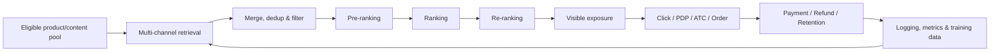

# 电商推荐系统链路｜E-commerce Recommendation System Pipeline

本文聚焦电商推荐系统的端到端链路、阶段接口和诊断方法，并提供各算法专题的阅读入口。

## 1. 从业务目标到反馈闭环

电商推荐不是单一的 CTR 模型，而是连接用户、商品、商家和内容的多目标决策系统：



核心判断不是“模型分数是否更高”，而是：

```text
候选是否合格且可交易？
→ 是否召回了有购买价值的候选？
→ 是否在逐层筛选中保留下来？
→ 最终列表是否兼顾体验、交易与生态？
→ 用户是否真实看到并完成高质量交易？
→ 增量是否由可信的在线实验验证？
```

### 1.1 每个阶段优化什么

推荐链路不是多个模型的简单串联，而是受计算预算约束的级联决策：

$$
\text{Item Pool}\xrightarrow{retrieval}C_1
\xrightarrow{pre\text{-}rank}C_2
\xrightarrow{rank}C_3
\xrightarrow{re\text{-}rank}S
$$

通常满足 `|C₁| ≫ |C₂| ≫ |C₃| ≫ |S|`。越靠前的阶段候选更多、单候选计算预算更低；越靠后的阶段可以使用更丰富的交叉特征和列表级目标。

| 阶段 | 典型学习问题 | 常见方法 |
|---|---|---|
| Retrieval | 在海量商品中最大化高价值候选覆盖 | ItemCF、Two-Tower、Graph、ANN |
| Pre-ranking | 在低延迟下保留精排高价值候选 | LR、GBDT、Small DNN、Distillation |
| Ranking | 估计用户—商品多目标价值 | DeepFM、DCN、DIN、MMoE、LTR |
| Re-ranking | 最大化整个列表的约束效用 | MMR、DPP、规则、Slate Optimization |
| Exploration | 在即时收益与信息获取间权衡 | UCB、Thompson Sampling、Bandit |

## 2. 阶段职责与分析重点

| 阶段 | 主要职责 | 典型诊断指标 |
|---|---|---|
| Eligibility | 库存、审核、市场、物流、商家与安全约束 | eligible item count、过滤原因、库存覆盖 |
| Retrieval | 从大规模商品/内容池获得高潜候选 | recall size、channel contribution、coverage、overlap |
| Pre-ranking | 在延迟预算内保留高价值候选 | pass rate、top-K retention、latency |
| Ranking | 预测点击、加购、下单、成交及长期价值 | AUC、log loss、calibration、score distribution |
| Re-ranking | 做列表级效用、去重、多样性与约束 | seller/category concentration、freshness、diversity |
| Exposure | 记录用户真正看到的结果 | visible impression、logging coverage、position |
| Commerce funnel | 衡量兴趣到高质量交易的转化 | CTR、PDP rate、ATC rate、CVR、AOV、Net GMV |
| Ecosystem | 观察供给与流量分配的长期健康 | seller/item coverage、new-item success、concentration |

后一阶段只能处理前一阶段留下的候选。因此，精排提升无法补救召回缺失，重排也无法恢复粗排已经过滤的商品。

## 3. 多目标价值

一个便于诊断的 GMV 分解是：

```text
GMV ≈ Impressions × CTR × Purchase CVR × AOV
```

实际决策还要考虑取消、退款、履约、用户留存和商家生态。因而 `CTR ↑` 并不自动代表成功：点击提升可能伴随 CVR、AOV 或订单质量下降。

实验前应预先定义：

- Primary metric：与实验假设最直接的成功指标；
- Guardrail：用户体验、交易质量、系统稳定性与生态风险；
- Diagnostic metrics：定位增量来自链路的哪一步；
- Long-term metrics：复购、留存、商家供给与长期净价值。

完整定义见 [metrics.md](./metrics.md)。

## 4. 一次请求中的关键数据接口

建议至少能串联以下标识与字段：

```text
request_id / user_id / session_id
experiment_id / variant
candidate source / stage score / filter reason
item_id / seller_id / content_id
rank position / exposure timestamp
click / PDP / ATC / order / payment / refund
market / device / traffic surface
```

分析粒度必须与实验单位、随机化单位和指标聚合方式一致。服务端返回不等于有效曝光；订单创建也不等于最终支付或净成交。

## 5. 线上异常的链路化诊断

以 `CTR +3%，Net GMV -2%` 为例：

1. 先检查 SRM、实验污染、曝光日志、订单归因和退款成熟窗口。
2. 分解 impression、CTR、CVR、AOV、取消率与退款率。
3. 检查召回渠道、类目、价格带、商家和新老商品 mix。
4. 检查粗排 pass rate 与高价值候选保留率。
5. 检查精排各任务的校准、分数分布和目标间 trade-off。
6. 检查重排规则是否改变 seller/category/price concentration。
7. 按市场、新老用户、设备、流量入口和供给类型做预注册分群。

对应实验判断顺序：

```text
Validity → Data quality → Effect size → Funnel diagnosis
→ Segment risk → System health → Go / Iterate / Rollback
```

## 6. 主题文档

| Topic | 文档 | 重点 |
|---|---|---|
| 业务背景 | [ecommerce-recommendation-context.md](./ecommerce-recommendation-context.md) | 业务对象、交易漏斗与分析边界 |
| 召回 | [retrieval.md](./retrieval.md) | CF、双塔、样本、ANN、多路召回 |
| 粗排与精排 | [ranking.md](./ranking.md) | 多任务预估、多目标融合与校准 |
| 特征交叉 | [feature-interaction.md](./feature-interaction.md) | FM、DeepFM、DCN、FiBiNET |
| 行为序列 | [user-behavior-sequence.md](./user-behavior-sequence.md) | LastN、DIN、DIEN 与兴趣漂移 |
| 重排 | [reranking.md](./reranking.md) | MMR、DPP、规则、探索与生态约束 |
| 冷启动 | [cold-start.md](./cold-start.md) | 新商品、新商家、新用户与探索 |
| 系统优化 | [system-optimization.md](./system-optimization.md) | 召回配额、迭代路线与诊断框架 |

## 7. 从离线到上线

模型或策略的交付链路见 [online-experiment-lifecycle.md](./online-experiment-lifecycle.md)：

```text
Business hypothesis → Metric contract → Offline evaluation
→ A/A when needed → A/B test → Ramp-up → Rollout / Holdout
```

实验相关专题：[A/A Testing](./aa-testing.md)、[A/B Testing](./ab-testing.md)、[Ramp-up](./ramp-up.md)。
